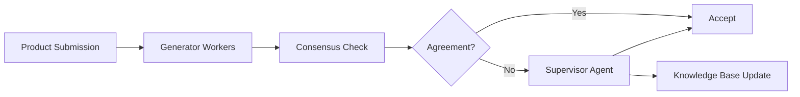

{/*
  HIDDEN PENDING VERIFICATION - do not restore to navigation until resolved.
  This page's content must be verified or removed. Each claim needs an externally
  shareable source before the page returns to navigation. Outstanding items:
  the three TODO-marked claims below (Gateway usage, technical decisions,
  lessons learned) must each be verified against the linked public blog post
  or deleted.
*/}

# Amazon.com Catalog - Self-Learning GenAI at Scale

 **Workload:** Workflow agent

 [Blog Post →](https://aws.amazon.com/blogs/machine-learning/how-the-amazon-com-catalog-team-built-self-learning-generative-ai-at-scale-with-amazon-bedrock/)

**Industry:** E-commerce | **Workload pattern:** Generator-evaluator-supervisor (self-learning) | **Integration type:** Product data APIs, knowledge base

---

## Source

[AWS Machine Learning Blog - How the Amazon.com Catalog Team Built Self-Learning Generative AI at Scale with Amazon Bedrock](https://aws.amazon.com/blogs/machine-learning/how-the-amazon-com-catalog-team-built-self-learning-generative-ai-at-scale-with-amazon-bedrock/)

Publication date: See linked source.

---

## Customer context

The Amazon.com Catalog Team manages millions of daily product submissions from sellers worldwide. Product classification and validation must operate at massive scale with high accuracy, while adapting to continuously evolving product categories without manual retraining cycles.

---

## Challenge

Scaling product classification and validation to millions of submissions per day while maintaining accuracy and reducing costs. Manual review was not feasible at this scale, and traditional ML models required constant retraining as product categories evolved.

---

## Solution

The team chose to build a generator-evaluator-supervisor architecture where lightweight worker agents (Amazon Nova Lite) handle routine cases in parallel. When workers disagree, a supervisor agent (Claude Sonnet) resolves disputes and extracts reusable learnings that improve future decisions. The system improves over time without retraining as the knowledge base grows from resolved disputes.

---

## AgentCore services used

| AgentCore Service | How Amazon Catalog configured it                          | Why it mattered                                                   |
|-------------------|-----------------------------------------------------------|-------------------------------------------------------------------|
| Runtime           | Multi-tier: Nova Lite workers + Claude Sonnet supervisor | Cost-optimized: inexpensive models for routine volume, more capable models only for disputed cases |
| Gateway           | Unified tool access for product data and validation APIs  | Centralized governance over product classification decisions     |
| Observability     | Full trace capture of consensus and escalation decisions  | Track where the system struggled and improve the knowledge base  |

{/* TODO: Validate Gateway usage when public reference is available */}

---

## Architecture pattern

*Architecture interpretation by this site based on the public source.*

The diagram above shows product submissions entering a pool of parallel lightweight worker agents. When workers reach consensus, the classification is accepted. When they disagree, the submission escalates to the supervisor agent, which resolves the dispute and writes a reusable rule back to the knowledge base, reducing future escalations.

**Entry point:** A product submission from a seller.
**Main flow:** Parallel lightweight workers classify the submission independently. A consensus check compares their outputs. Agreement leads to acceptance. Disagreement escalates to the supervisor, which resolves and feeds the decision back to the knowledge base.
**Key boundary:** The knowledge base is the learning mechanism; the supervisor writes reusable rules after each dispute resolution, which reduces future escalation rates over time.

---

## Results

  Error rates continuously decline
  Costs decrease over time
  Millions of products per day
  No retraining required

---

## Transferable lessons

{/* TODO: Update technical decisions and lessons learned when public reference is available */}

- The team chose a multi-tier model strategy at this scale: inexpensive models handled high-volume routine cases; more capable models engaged only on disputes. This controlled cost proportionally to complexity rather than applying uniform compute to every submission.
- Consensus-based escalation caught edge cases that a single model would have handled confidently but incorrectly. Disagreement between workers was a reliable signal that a case warranted deeper reasoning.
- Writing reusable rules to a knowledge base after each supervisor decision created a self-improving system. Error rates declined and escalation rates fell without requiring model retraining cycles.

{/* TODO: Validate lessons learned when public reference is available */}

---

## When this is relevant

This pattern fits high-volume classification or validation workloads where most cases are routine, a minority require complex judgment, and the cost of uniform high-capability processing would be prohibitive. The self-learning mechanism (supervisor writes rules back to knowledge base) is appropriate when disputes contain reusable information. The generator-evaluator-supervisor structure is reusable for quality assurance, content moderation, and data validation at scale.

---

## Source and verification

- [AWS Machine Learning Blog - How the Amazon.com Catalog Team Built Self-Learning Generative AI at Scale with Amazon Bedrock](https://aws.amazon.com/blogs/machine-learning/how-the-amazon-com-catalog-team-built-self-learning-generative-ai-at-scale-with-amazon-bedrock/)
- Last verified: 2026-07-15
