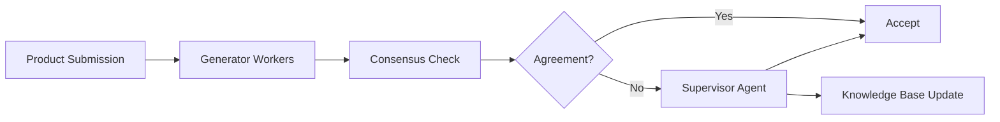

# Amazon.com Catalog - Self-Learning GenAI at Scale

 **Workload:** Workflow agent

 [Blog Post →](https://aws.amazon.com/blogs/machine-learning/how-the-amazon-com-catalog-team-built-self-learning-generative-ai-at-scale-with-amazon-bedrock/)

---

## Architecture

## Customer Story

**Customer:** Amazon.com Catalog Team, managing millions of daily product submissions from sellers worldwide

**Challenge:** Scaling product classification and validation to millions of submissions per day while maintaining accuracy and reducing costs. Manual review was not feasible at this scale, and traditional ML models required constant retraining as product categories evolved.

**Solution:** Generator-evaluator-supervisor architecture where lightweight workers (Amazon Nova Lite) handle routine cases in parallel. When workers disagree, a supervisor (Claude Sonnet) resolves disputes and extracts reusable learnings that improve future decisions. The system gets smarter over time without retraining, and error rates continuously decline as the knowledge base grows.

## AgentCore Configuration

| AgentCore Service | Configuration for Amazon Catalog                          | Why It Matters                                                    |
|-------------------|-----------------------------------------------------------|-------------------------------------------------------------------|
| Runtime           | Multi-tier: Nova Lite workers + Claude Sonnet supervisor | Cost-optimized: cheap models for routine, expensive for disputes |
| Gateway           | Unified tool access for product data and validation APIs  | Centralized governance over product classification decisions     |
| Observability     | Full trace capture of consensus and escalation decisions  | Track where the system struggles and improve the knowledge base  |

<!-- TODO: Validate Gateway usage when public reference is available -->

## Key Technical Decisions

- **Generator-evaluator-supervisor pattern** rather than a single model. Lightweight models handle high-volume routine cases, expensive models only engage on disputes. This optimized cost at scale.
- **Consensus-based escalation** where disagreement between workers triggers the supervisor. This caught edge cases that a single model would miss.
- **Self-learning via knowledge base updates.** When the supervisor resolves a dispute, it extracts a reusable rule that improves future decisions without retraining.

<!-- TODO: Update technical decisions when public reference is available -->

## Results

  Error rates continuously decline
  Costs decrease over time
  Millions of products/day
  No retraining required

## Lessons Learned

- **Multi-tier model strategy beats single-model at scale.** Use cheap models for volume, expensive models only when needed.
- **Consensus-based escalation catches edge cases** that a single model would handle confidently but incorrectly.
- **Self-learning without retraining** is possible when you extract and store reusable rules from supervisor decisions.

<!-- TODO: Validate lessons learned when public reference is available -->
