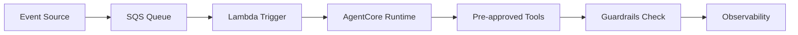

# AutoScout24 - Bot Factory for Standardized AI Agent Development

 **Workload:** Agent platform

 [Blog Post →](https://aws.amazon.com/blogs/machine-learning/how-autoscout24-built-a-bot-factory-to-standardize-ai-agent-development-with-amazon-bedrock/)

**Industry:** Automotive marketplace | **Workload pattern:** Event-driven, platform/governance | **Integration type:** SQS + Lambda + AgentCore Runtime

---

## Source

[AWS Machine Learning Blog - How AutoScout24 Built a Bot Factory to Standardize AI Agent Development with Amazon Bedrock](https://aws.amazon.com/blogs/machine-learning/how-autoscout24-built-a-bot-factory-to-standardize-ai-agent-development-with-amazon-bedrock/)

Publication date: See linked source.

---

## Customer context

AutoScout24 is Europe's largest online car marketplace, connecting buyers and sellers across multiple markets. Multiple product teams were independently building agent solutions, creating a governance and consistency challenge at scale.

---

## Challenge

Teams building agents in isolation produced inconsistent patterns, duplicated effort on authentication and observability, and varied security postures across the organization. No shared guardrails meant each agent required separate security and operational review. There was no org-wide governance mechanism.

---

## Solution

AutoScout24 chose to build a reusable blueprint called "Bot Factory" for standardized agent creation. Teams self-serve agent deployment using pre-approved templates, tools, and guardrails. The factory standardizes the trigger pattern (SQS to Lambda to AgentCore Runtime) across all agents and enforces a pre-approved tool catalog, so governance review happens once per tool rather than per agent.

---

## AgentCore services used

| AgentCore Service | How AutoScout24 configured it                             | Why it mattered                                                   |
|-------------------|-----------------------------------------------------------|-------------------------------------------------------------------|
| Runtime           | Event-driven, SQS to Lambda to AgentCore                  | Standardized async pattern; scaled automatically with event load |
| Observability     | Mandatory trace capture for every agent                   | Central visibility into all agent executions across teams        |

---

## Architecture pattern

*Architecture interpretation by this site based on the public source.*

An event from any business system enters an SQS queue. A Lambda function triggers the relevant agent on AgentCore Runtime. The agent executes using only pre-approved tools, passes through a Guardrails check, and records the execution to observability. All teams share this same pipeline; the factory templates encode it.

**Entry point:** A business event published to SQS by any team's service.
**Main flow:** Lambda consumes the event and invokes the agent on AgentCore Runtime. The agent selects from the pre-approved tool catalog. Guardrails validate the action before execution. The full trace is captured.
**Key boundary:** The pre-approved tool catalog acts as the governance boundary; agents cannot call APIs outside this catalog.

---

## Results

  Standardized agent development
  Self-serve agent deployment
  Pre-approved guardrails
  Reduced time-to-production

---

## Transferable lessons

- AutoScout24 chose to encode best practices in templates rather than documentation. Development teams adopted the factory patterns without reading governance guidelines because the templates were the path of least resistance.
- Centralizing tool governance at the catalog level (approve once, reuse everywhere) meant security reviews did not block individual teams. Tools were reviewed before entering the catalog, not on each new agent.
- Standardizing on one event trigger pattern (SQS-Lambda-Runtime) simplified operations. A single runbook covered all agents in production.

---

## When this is relevant

This pattern fits organizations scaling agent development across many teams, where consistency and governance matter as much as speed. The bot factory or "golden path" approach works well when teams are willing to accept a standard template in exchange for fast, approved deployment. The event-driven SQS-Lambda trigger pattern applies broadly to async workloads that do not require real-time responses.

---

## Source and verification

- [AWS Machine Learning Blog - How AutoScout24 Built a Bot Factory to Standardize AI Agent Development with Amazon Bedrock](https://aws.amazon.com/blogs/machine-learning/how-autoscout24-built-a-bot-factory-to-standardize-ai-agent-development-with-amazon-bedrock/)
- Last verified: 2026-07-15
