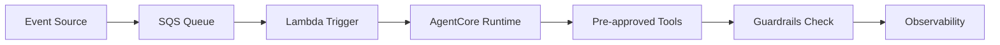

# AutoScout24 - Bot Factory for Standardized AI Agent Development

 **Workload:** Agent platform

 [Blog Post →](https://aws.amazon.com/blogs/machine-learning/how-autoscout24-built-a-bot-factory-to-standardize-ai-agent-development-with-amazon-bedrock/)

---

## Architecture

## Customer Story

**Customer:** AutoScout24, Europe's largest online car marketplace connecting buyers and sellers across multiple markets

**Challenge:** Teams building agents in isolation with inconsistent patterns, no shared guardrails, and duplicated effort. Each team reinvented authentication, tool integration, and observability. No org-wide governance meant agents varied wildly in security posture and operational readiness.

**Solution:** Reusable blueprint called "Bot Factory" for standardized agent creation. Teams self-serve agent deployment using pre-approved templates, tools, and guardrails. The factory ensures consistency and compliance at scale. Event-driven architecture (SQS to Lambda to AgentCore Runtime) standardizes the trigger pattern across all agents.

## AgentCore Configuration

| AgentCore Service | Configuration for AutoScout24                             | Why It Matters                                                    |
|-------------------|-----------------------------------------------------------|-------------------------------------------------------------------|
| Runtime           | Event-driven, SQS to Lambda to AgentCore                  | Standardized async pattern, scales automatically with event load |
| Observability     | Mandatory trace capture for every agent                   | Central visibility into all agent executions across teams        |

## Key Technical Decisions

- **Event-driven async pattern** (SQS to Lambda to AgentCore) standardized across all agents rather than letting each team pick their own trigger mechanism. This simplified operations and cost management.
- **Pre-approved tool catalog** rather than allowing teams to integrate arbitrary APIs. Tools go through a governance review before entering the factory.
- **Templates encode best practices** for auth, error handling, and observability. New agents start with production-grade patterns rather than learning through failure.

## Results

  Standardized agent development
  Self-serve agent deployment
  Pre-approved guardrails
  Reduced time-to-production

## Lessons Learned

- **Templates beat documentation** for spreading best practices. Developers used the factory templates without reading governance docs.
- **Pre-approved tool catalogs reduce risk** without slowing teams down. Tool review happened once, not per-agent.
- **Standardized architecture simplifies operations.** One SQS-Lambda-Runtime pattern meant one ops runbook for all agents.
