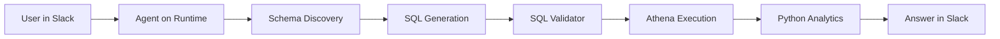

# BGL - Democratizing BI with Claude Agent SDK + AgentCore

 **Workload:** Conversational agent

 [Blog Post →](https://aws.amazon.com/blogs/machine-learning/democratizing-business-intelligence-bgls-journey-with-claude-agent-sdk-and-amazon-bedrock-agentcore/)

**Industry:** Financial Services (SMSF administration) | **Workload pattern:** Conversational NL-to-SQL | **Integration type:** Slack + Amazon Athena

---

## Source

[AWS Machine Learning Blog - Democratizing Business Intelligence: BGL's Journey with Claude Agent SDK and Amazon Bedrock AgentCore](https://aws.amazon.com/blogs/machine-learning/democratizing-business-intelligence-bgls-journey-with-claude-agent-sdk-and-amazon-bedrock-agentcore/)

Publication date: See linked source.

---

## Customer context

BGL is a provider of SMSF (self-managed superannuation fund) administration software serving 12,700+ businesses across 15 countries. The company manages complex financial data across hundreds of analytics tables, with strict data access requirements tied to individual business accounts.

---

## Challenge

Business users depended on the data team for every analytics query. Even simple questions like "what were tax law filing trends last quarter?" required a ticket, a queue, and days of waiting. The data team was overwhelmed with repetitive ad-hoc requests and had little capacity for strategic analytical work.

---

## Solution

BGL chose to build a Slack-based AI agent using the Claude Agent SDK. Users ask questions in natural language in Slack; the agent discovers the schema from 400+ analytics tables (dbt and Athena), generates SQL, validates it (only SELECT queries are permitted), executes it, and returns the answer in the thread. Agent Skills partition the schema by domain (Tax Law, Investment Performance) so the agent reasons over a relevant subset rather than the full 400-table catalog.

---

## AgentCore services used

| AgentCore Service | How BGL configured it                                     | Why it mattered                                                   |
|-------------------|-----------------------------------------------------------|-------------------------------------------------------------------|
| Runtime           | Claude Agent SDK, Slack integration                       | Familiar interface; session isolation per user                   |
| Identity          | User-level auth propagated through agent                  | Data access policies enforced at query execution time            |

---

## Architecture pattern

*Architecture interpretation by this site based on the public source.*

A user sends a natural language question in Slack. The agent on AgentCore Runtime receives the message, identifies the relevant Agent Skill domain (Tax Law, Investment Performance, etc.), generates SQL against the Athena schema, validates the query to block non-SELECT operations, executes it, then returns the result in Slack.

**Entry point:** Natural language question in Slack.
**Main flow:** Schema discovery selects the relevant domain partition, SQL is generated and validated, Athena executes, and the answer returns to the user in the same Slack thread.
**Key boundary:** The SQL validator enforces read-only access; no INSERT, UPDATE, DELETE, or DROP statements are permitted regardless of what the model generates.

---

## Results

  200+ employees self-serve BI instantly
  No SQL knowledge required
  Data team freed for strategic work
  Compliance-aligned session isolation

---

## Transferable lessons

- BGL chose to partition the 400+ table schema into domain-specific Agent Skills rather than giving the agent access to the full catalog. Without this partitioning, context overload degraded accuracy on domain-specific queries.
- The SQL validator was a deliberate design choice to enforce read-only access. Generating a bad SQL statement is an expected failure mode for any NL-to-SQL agent; the validator ensures bad SQL cannot cause data modification.
- Deploying in Slack rather than building a custom web interface led to immediate adoption. No training was required because users were already working in Slack.

---

## When this is relevant

This pattern fits organizations where a large internal dataset is gated behind a specialist team, and where the majority of questions are read-only analytics. The Agent Skills partitioning approach applies anywhere the tool or knowledge space is too large for a single context window. The SQL validator pattern is a reusable safety layer for any agent that generates executable queries or code.

---

## Source and verification

- [AWS Machine Learning Blog - Democratizing Business Intelligence: BGL's Journey with Claude Agent SDK and Amazon Bedrock AgentCore](https://aws.amazon.com/blogs/machine-learning/democratizing-business-intelligence-bgls-journey-with-claude-agent-sdk-and-amazon-bedrock-agentcore/)
- Last verified: 2026-07-15
