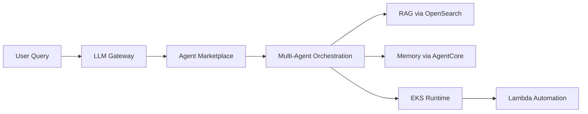

# Blue Origin - AI-Designed Lunar Hardware

 **Workload:** Coding agent

---

## Architecture

## Customer Story

**Customer:** Blue Origin, an aerospace manufacturer and spaceflight services company developing reusable rockets and lunar landers

**Challenge:** Engineers across the company needed secure access to LLMs for design work, but enterprise requirements (data security, audit trails, cost control) meant public LLM interfaces were not an option. Teams also needed agents to remember context across long-running hardware development cycles and to access internal documentation.

**Solution:** Enterprise AI platform called "BlueGPT" providing secure LLM access, an agent marketplace, multi-agent orchestration, RAG for internal docs (OpenSearch), and hierarchical memory (AgentCore Memory with short-term and long-term storage). Agents run on EKS for compute-heavy tasks and Lambda for automation. Memory captures context across sessions so agents remember prior design decisions and constraints.

## AgentCore Configuration

| AgentCore Service | Configuration for Blue Origin                             | Why It Matters                                                    |
|-------------------|-----------------------------------------------------------|-------------------------------------------------------------------|
| Memory            | Hierarchical: short-term (session) + long-term (entity)  | Lunar hardware design spans weeks; agents need cross-session context |

## Key Technical Decisions

- **Hierarchical memory architecture** (short-term for within-session context, long-term for cross-session learnings) because lunar hardware design is iterative over weeks. Agents need to remember prior design decisions.
- **Agent marketplace model** where teams publish and discover agents rather than centrally managing all agents. This scaled agent development across 2,700+ agents without a bottleneck.
- **Secure LLM gateway** rather than direct model access. All LLM calls routed through a governance layer that enforced data classification and audit trails.

## Results

  2,700+ agents
  3.5M interactions/month
  70% company-wide adoption
  75% faster lunar hardware development
  70% faster work-order resolution

## Lessons Learned

- **Memory is critical for long-running engineering workflows.** Without cross-session memory, agents repeatedly asked engineers to re-explain design constraints.
- **Agent marketplace beats centralized catalog** at scale. Teams built and shared agents organically rather than waiting for central approval.
- **Secure gateway enables enterprise adoption.** The data security and audit trail requirements would have blocked LLM adoption without the gateway layer.
