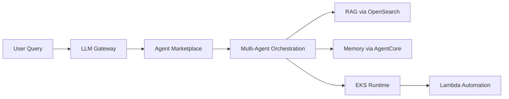

# Blue Origin - AI-Designed Lunar Hardware

 **Workload:** Coding agent

 [AWS Case Study →](https://aws.amazon.com/solutions/case-studies/blue-origin-case-study/)

**Industry:** Aerospace / Manufacturing | **Workload pattern:** Agent marketplace + hierarchical memory + multi-agent orchestration | **Integration type:** EKS runtime, OpenSearch RAG, Lambda automation

---

## Source

[AWS Case Study - Blue Origin](https://aws.amazon.com/solutions/case-studies/blue-origin-case-study/)

Publication date: See linked source.

---

## Customer context

Blue Origin is an aerospace manufacturer and spaceflight services company developing reusable rockets and lunar landers. Engineering at Blue Origin requires deep specialization across dozens of disciplines, and proprietary design knowledge does not reside in public datasets. The company operates under strict security, trade control, and export control requirements.

---

## Challenge

Engineers across the company needed secure access to LLMs for design and manufacturing work, but enterprise requirements (data security, audit trails, cost control, export compliance) ruled out public LLM interfaces. Base LLMs were not trained on the specifics of industrial manufacturing, thermal battery design, or regolith extraction. Design cycles for hardware like lunar landers spanned years, and teams needed agents that could remember context across those extended cycles. Scaling specialized expertise across small teams was a core constraint.

---

## Solution

Blue Origin chose to build an enterprise AI platform called "BlueGPT," which provides a secure LLM gateway, an agent marketplace, multi-agent orchestration, RAG for internal documentation (Amazon OpenSearch), and hierarchical memory (Amazon Bedrock AgentCore Memory with short-term session and long-term persistent storage). Agents run on Amazon EKS for compute-heavy simulation tasks and AWS Lambda for automation. The platform empowers every Blue Origin employee to create and deploy specialized agents. For the TEAREx lunar thermal battery project, a small team of 2-3 engineers worked alongside a coordinated set of AI agents (supervisors, librarians, requirements agents, design agents, analysis agents) that ran autonomous iterative design loops on GPU-accelerated EC2 instances.

---

## AgentCore services used

| AgentCore Service | How Blue Origin configured it                             | Why it mattered                                                   |
|-------------------|-----------------------------------------------------------|-------------------------------------------------------------------|
| Memory            | Hierarchical: short-term (session) + long-term (persistent entity) | Lunar hardware design spans weeks; agents needed to remember design decisions and constraints across sessions without requiring engineers to repeat context |

---

## Architecture pattern

*Architecture interpretation by this site based on the public source.*

All LLM calls route through a secure LLM Gateway that enforces data classification and audit trails. Requests go to an agent marketplace where teams discover and invoke published agents. Complex tasks use multi-agent orchestration with specialized domain agents. RAG is provided by Amazon OpenSearch over internal knowledge bases. AgentCore Memory stores short-term session context and long-term persistent knowledge. Agents run on EKS for simulation workloads and Lambda for automation.

**Entry point:** An employee query or automated workflow trigger routed through the LLM Gateway.
**Main flow:** The gateway enforces security policies and routes to the agent marketplace. Multi-agent orchestration assembles the right specialist agents for the task. Agents draw on OpenSearch RAG for internal knowledge and AgentCore Memory for cross-session context.
**Key boundary:** The LLM Gateway is the security perimeter; no LLM call exits this layer without passing data classification checks and generating an audit record.

---

## Results

  2,700+ agents in the marketplace
  3.5M interactions per month
  70% company-wide adoption
  90% reduction in hardware development time (years to days)
  6x acceleration in analysis workflows (4 days to 4 hours)
  70% faster work-order resolution
  World's first agentically-designed lunar hardware (TEAREx)

---

## Transferable lessons

- Blue Origin chose a hierarchical memory architecture because lunar hardware design is iterative over weeks. Short-term memory handled within-session context; long-term persistent memory preserved design decisions and constraints across sessions. Without cross-session memory, agents repeatedly asked engineers to re-explain prior decisions.
- The agent marketplace model let teams publish and discover agents organically, which scaled development to 2,700+ agents without a central bottleneck or approval queue. Centralized catalogs would have throttled adoption.
- Routing all LLM calls through a secure gateway was a prerequisite for enterprise adoption at Blue Origin. The data security, audit trail, and export control requirements would have blocked LLM use entirely without this layer.
- Reducing AI application development time from weeks to hours (described as approximately a 10x improvement) came from reusable agent patterns in the marketplace, not from raw model capability.

---

## When this is relevant

This pattern fits organizations where specialized domain knowledge is largely proprietary and not available in public model training data, and where security, audit, and compliance requirements are non-negotiable. The hierarchical memory approach is relevant for any long-horizon engineering or research workflow where agents need to maintain context across many sessions over days or weeks. The agent marketplace model scales agent development across large organizations by enabling self-service publishing and discovery.

---

## Source and verification

- [AWS Case Study - Blue Origin](https://aws.amazon.com/solutions/case-studies/blue-origin-case-study/)
- Last verified: 2026-07-15
