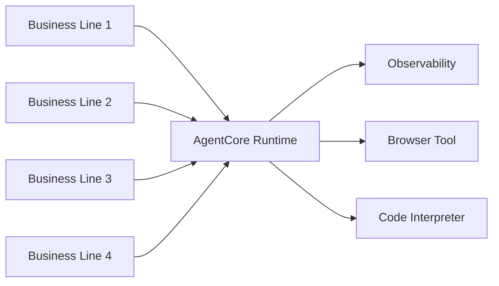

# Cox Automotive - 17 Solutions in Production

 **Workload:** Multi-pattern

---

## Architecture

## Customer Story

**Customer:** Cox Automotive, a leading automotive services company serving dealers, consumers, and manufacturers across the vehicle lifecycle

**Challenge:** Diverse AI needs across multiple business lines including dealer tools, consumer experiences, inventory management, and marketplace operations. Each business line required different agent patterns (conversational, event-driven, platform) but needed consistent governance, observability, and operational patterns.

**Solution:** Large-scale deployment of AI-powered solutions using Strands Agents framework across the automotive marketplace. Multiple agent patterns deployed for different use cases including conversational customer service, event-driven workflow automation, and platform assistants. All agents run on AgentCore Runtime with unified observability and governance.

## AgentCore Configuration

| AgentCore Service | Configuration for Cox Automotive                          | Why It Matters                                                    |
|-------------------|-----------------------------------------------------------|-------------------------------------------------------------------|
| Runtime           | Multi-pattern support (chat, event, platform)             | Different business lines need different agent patterns           |
| Observability     | Unified trace capture across all 17 solutions             | Central visibility into agent performance across business lines  |
| Browser Tool      | Web automation for data extraction tasks                  | Many automotive workflows require web scraping and form filling  |
| Code Interpreter  | Dynamic data analysis and visualization                   | Dealers need ad-hoc analytics on inventory and pricing data      |

## Key Technical Decisions

- **Multi-pattern deployment** rather than forcing all business lines into one agent archetype. Conversational agents for customer service, event-driven agents for workflows, platform agents for internal tooling.
- **Strands Agents framework** for multi-agent orchestration and coordination. Some solutions required agent-to-agent communication and handoffs.
- **5 agentic AI products launched in 5 weeks** by building on a common platform rather than custom-building each one. Shared runtime, observability, and governance accelerated delivery.

## Results

  5 agentic AI products launched in 5 weeks
  Multiple agent patterns deployed
  Consistent governance across solutions
  Scaled AI adoption enterprise-wide

## Lessons Learned

- **Platform approach accelerates delivery** when you have multiple agent use cases. The first agent takes time, the fifth takes days.
- **Different patterns for different workloads.** Conversational agents for customer service, event-driven agents for backend workflows, platform agents for internal tools. One pattern would not have fit all needs.
- **Unified observability is critical at scale.** With 17 solutions in production, central visibility into agent performance and errors was non-negotiable.
