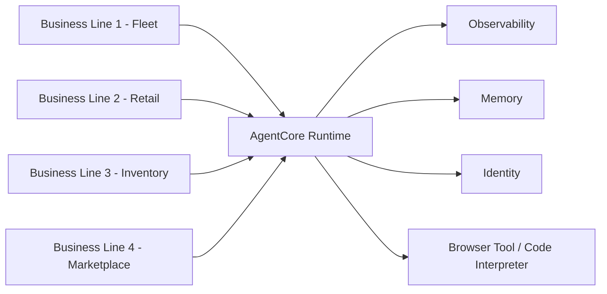

# Cox Automotive - 17 Solutions in Production

 **Workload:** Multi-pattern

 [AWS Case Study →](https://aws.amazon.com/solutions/case-studies/cox-auto-case-study/)

**Industry:** Automotive services | **Workload pattern:** Multi-pattern (conversational, event-driven, platform) | **Integration type:** Telematics APIs, retail session memory, identity and access

---

## Source

[AWS Case Study - Cox Automotive](https://aws.amazon.com/solutions/case-studies/cox-auto-case-study/)

Publication date: See linked source.

---

## Customer context

Cox Automotive is a leading automotive services company serving dealers, consumers, and manufacturers across the vehicle lifecycle. Its portfolio spans multiple brands, each with distinct AI needs: fleet management, retail experiences, inventory tools, and marketplace operations.

---

## Challenge

Cox Automotive had diverse AI needs across multiple business lines. Each line required different agent patterns (conversational, event-driven, platform), but the organization needed consistent governance, observability, and operational patterns across all of them. Building each solution from scratch would not scale.

---

## Solution

Cox Automotive chose to build on a common platform using Amazon Bedrock AgentCore and Strands Agents, creating repeatable patterns that scaled across the organization. FleetMate, a fleet services platform, was built on AgentCore Runtime, enabling the team to deploy agentic solutions in days instead of months. AgentCore Memory maintains conversation context across sessions for both fleet operations and retail customer journeys. AgentCore Observability logged all interactions, enabling debugging of multi-step reasoning failures and refinement based on actual usage. AgentCore Identity provided granular permission management and role-based access controls across Cox's brands and customer data.

---

## AgentCore services used

| AgentCore Service | How Cox Automotive configured it                          | Why it mattered                                                   |
|-------------------|-----------------------------------------------------------|-------------------------------------------------------------------|
| Runtime           | Multi-pattern support (chat, event, platform)             | Different business lines needed different agent patterns under one operational model |
| Memory            | Cross-session context for fleet ops and retail journeys   | FleetMate agents knew truck, route, and maintenance history; retail agents remembered the full buying journey across web, mobile, and in-person |
| Observability     | Unified trace capture across all 17 solutions             | Enabled debugging of multi-step reasoning failures across business lines |
| Identity          | Granular permission management and role-based access      | Enforced strict data governance while scaling across brands and customer data |
| Browser Tool      | Web automation for data extraction tasks                  | Automotive workflows requiring web data retrieval                |
| Code Interpreter  | Dynamic data analysis and visualization                   | Ad-hoc analytics on inventory and pricing data                   |

---

## Architecture pattern

*Architecture interpretation by this site based on the public source.*

Multiple business lines feed requests into AgentCore Runtime. Each business line may use a different pattern (conversational, event-driven, or orchestrated). Memory, Observability, and Identity services are shared across all 17 solutions. The Orchestrator Agent for fleet operations integrates telematics APIs, real-time diagnostics, and external data sources.

**Entry point:** A customer interaction, driver call, or business event from any of Cox's brands.
**Main flow:** AgentCore Runtime dispatches to the appropriate agent for that business line. The agent uses Memory for context continuity, Identity for permissioned data access, and Observability for trace capture.
**Key boundary:** Identity service enforces that each agent operates only with precisely defined permissions, critical when handling sensitive data across multiple brands.

---

## Results

  17 major agentic solutions in production
  5 agentic AI products launched in 5 weeks
  Zero to production-ready in one month
  7 market-transformational solutions in development
  Consistent governance across all solutions

---

## Transferable lessons

- Cox Automotive chose to build on a shared platform rather than custom-build each solution. The first agent required the most investment; subsequent agents reused the established patterns, which drove the five-products-in-five-weeks pace.
- The team found that different business lines needed genuinely different agent patterns. A single pattern would not have served fleet operations (event-driven, context-rich), retail customer journeys (conversational, cross-session), and internal tooling (platform). Choosing AgentCore's multi-pattern support let each line use the right approach.
- Observability was essential for debugging at scale. With 17 solutions in production, the Observability service's interaction logs allowed engineers to trace multi-step reasoning failures without instrumenting each agent separately.
- Context continuity via Memory changed the experience for fleet drivers. Knowing the truck, route, and maintenance history at the start of a call shifted the interaction from transactional to relationship-based, per Cox's own description.

---

## When this is relevant

This pattern fits large organizations with multiple distinct agent use cases that benefit from a shared operational foundation. The platform approach (shared Runtime, Memory, Observability, Identity) pays off most when there are five or more agent workloads to build, since the infrastructure investment amortizes across them. The Memory service's cross-session capability is relevant wherever a customer or user interacts with an agent across multiple touchpoints or over extended time periods.

---

## Source and verification

- [AWS Case Study - Cox Automotive](https://aws.amazon.com/solutions/case-studies/cox-auto-case-study/)
- Last verified: 2026-07-15
