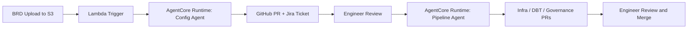

# Formula 1 - Data Accelerator for MarTech Data Operations

 **Workload:** Workflow

 [Blog Post →](https://aws.amazon.com/blogs/machine-learning/from-weeks-to-minutes-how-formula-1-uses-agentic-ai-on-aws-to-accelerate-data-operations/)

**Industry:** Media / Sports | **Workload pattern:** Event-driven, workflow automation | **Integration type:** S3 + Lambda + AgentCore Runtime

---

## Source

[AWS Machine Learning Blog - From weeks to minutes: How Formula 1® uses agentic AI on AWS to accelerate data operations](https://aws.amazon.com/blogs/machine-learning/from-weeks-to-minutes-how-formula-1-uses-agentic-ai-on-aws-to-accelerate-data-operations/)

Publication date: 2026-08-03.

---

## Customer context

Formula 1 partnered with AWS to build the Data Accelerator, a solution that transforms F1's MarTech data platform, "Customer 360," from a manually maintained system into a self-managed, observable, and unified data estate.

---

## Challenge

Onboarding a new data source into the platform required up to 6-8 weeks of manual engineering work: schema mapping, data quality checks, GDPR classification, and governance policy authoring, all done by hand. An 18-month integration backlog had built up as a result.

---

## Solution

F1 built a set of platform agents, hosted on AgentCore Runtime, that take a Business Requirements Document (BRD) with limited information about a data source and produce a fully production-ready onboarding pipeline in two phases. In Phase 1, an uploaded BRD triggers a Lambda function that invokes the agent to generate configuration files and open a pull request plus a linked Jira ticket for engineer review. In Phase 2, once configuration is approved, the agent generates three linked pull requests covering infrastructure code (AWS Glue), data transformations (DBT), and governance policies (including GDPR tagging). A human engineer reviews and approves every generated artifact before it merges — F1 calls this principle "Human at the helm." Agents also detect upstream schema changes via EventBridge and generate remediation code automatically.

---

## AgentCore services used

| AgentCore Service | How F1 configured it | Why it mattered |
|---|---|---|
| Runtime | Invoked from Lambda on BRD upload and on approval to generate config and pipeline code | Hosted the agents that read requirements documents and generated infrastructure, transformation, and governance code |
| Observability | Built-in tracing of all agent conversations and actions | Every agent decision is auditable in CloudWatch, supporting the human-review workflow |

---

## Architecture pattern

*Architecture interpretation by this site based on the public source.*

A team member uploads a Business Requirements Document to S3, which triggers a Lambda function that invokes an agent on AgentCore Runtime. The agent generates configuration files and opens a GitHub pull request plus a Jira ticket. Once an engineer approves the configuration, a second agent invocation generates three parallel pull requests (infrastructure, transformation, governance) linked to one Jira ticket for traceability. Separately, EventBridge triggers schema-change detection when an upstream data source changes shape.

**Entry point:** A Business Requirements Document uploaded to S3 by a team member.
**Main flow:** Lambda invokes the AgentCore Runtime agent, which generates artifacts and opens pull requests and Jira tickets at each phase. A human approves before code merges at every stage.
**Key boundary:** Every agent-generated artifact lands as a pull request or Jira ticket for human review rather than merging or deploying autonomously.

---

## Results

  Onboarding: 6-8 weeks to ~40 minutes of code generation
  Agents handle 95% of onboarding tasks autonomously
  18-month integration backlog cleared in weeks
  Automated schema-change detection and remediation

---

## Transferable lessons

- F1 chose to keep humans at every merge and deployment decision ("Human at the helm") rather than granting agents autonomous write access to production systems. Every agent output becomes a reviewable artifact — a pull request or ticket — not a direct change.
- Splitting the work into two distinct, separately-approved phases (configuration, then pipeline generation) gave engineers a natural checkpoint to catch mistakes before the larger set of infrastructure changes generated.
- Linking every generated artifact to a single Jira ticket per onboarding request preserved traceability across multiple repositories and pull requests.

---

## When this is relevant

This pattern fits organizations with a recurring, well-defined but labor-intensive integration or onboarding process, where the bottleneck is engineering time rather than judgment. It works well when the process can be decomposed into a documented input (like a BRD) and a set of reviewable code artifacts, and when human approval gates are acceptable at each phase rather than requiring full autonomy.

---

## Source and verification

- [AWS Machine Learning Blog - From weeks to minutes: How Formula 1® uses agentic AI on AWS to accelerate data operations](https://aws.amazon.com/blogs/machine-learning/from-weeks-to-minutes-how-formula-1-uses-agentic-ai-on-aws-to-accelerate-data-operations/)
- Last verified: 2026-08-19
