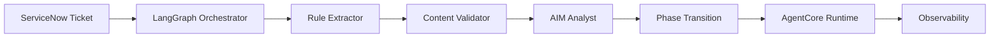

# Iberdrola - AI Agents for IT Operations

 **Workload:** Workflow + conversational agent

 [Blog Post →](https://aws.amazon.com/blogs/machine-learning/iberdrola-enhances-it-operations-using-amazon-bedrock-agentcore/)

## Architecture

Multi-agent IT operations system with LangGraph orchestration, VPC-secured and integrated with enterprise identity.

## Customer Story

**Customer:** Iberdrola, a global energy utility operating across Europe, the Americas, and beyond

**Challenge:** Manual ServiceNow change and incident management created bottlenecks. Change requests required multiple human validation steps, and incident resolution was slowed by incomplete ticket data. IT teams spent significant time on repetitive triage and data enrichment tasks.

**Solution:** Multi-agent AI system built with LangGraph and deployed on AgentCore. Three agentic patterns: (1) Sequential validation pipeline for change requests (Rule Extractor, Content Validator, AIM Analyst, Phase Transition), (2) Orchestrated incident enrichment that pulls context from multiple sources, and (3) Conversational change model assistant. LiteLLM routes between Amazon Nova and Claude based on task complexity.

## AgentCore Configuration

| AgentCore Service | Configuration for Iberdrola                               | Why It Matters                                                    |
|-------------------|-----------------------------------------------------------|-------------------------------------------------------------------|
| Runtime           | LangGraph agents in VPC, model routing via LiteLLM       | VPC isolation meets security requirements, flexible model choice |
| Observability     | Full trace capture of orchestration and agent decisions   | Root-cause analysis when agents route incorrectly                |
| Identity          | Entra ID OAuth 2.0 integration                            | Agents act on behalf of authenticated users                      |

## Key Technical Decisions

- **LangGraph for multi-step orchestration** because change request validation is inherently sequential (rule extraction must complete before content validation). LangGraph's state machine fit the existing ServiceNow workflow mental model.
- **LiteLLM as a model router** to balance cost and quality. Routine triage uses Nova Micro, complex analysis escalates to Claude Sonnet.
- **Three distinct agentic patterns** rather than one generic agent. Each pattern (validation pipeline, enrichment, conversational) has different orchestration needs and failure modes.

## Results

  Reduced bottlenecks in change management
  Faster incident resolution
  VPC-secured, enterprise identity integrated
  Framework-agnostic deployment

## Lessons Learned

- **Different tasks need different orchestration patterns.** Validation pipelines are sequential, incident enrichment is parallel, conversational agents are iterative. A single orchestration approach would have been suboptimal.
- **Model routing reduces cost without sacrificing quality** when you route by task complexity rather than applying the most expensive model everywhere.
- **VPC deployment is not a barrier** to using AgentCore. Secure, private connectivity to ServiceNow and internal tools worked out of the box.
