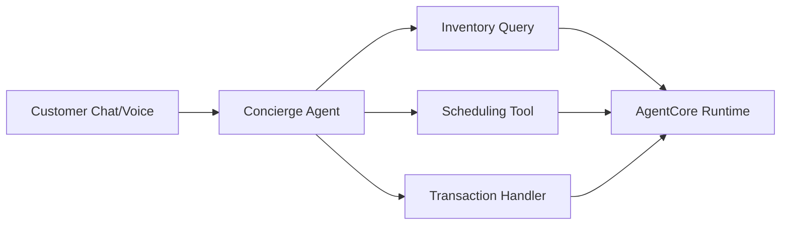

# Kavak - Autonomous Concierge Agent

 **Workload:** Conversational agent

---

## Architecture

<!-- TODO: Update when public reference is available -->

## Customer Story

**Customer:** Kavak, Latin America's largest used car marketplace operating across multiple countries

**Challenge:** High volume of customer inquiries about vehicle availability, financing options, scheduling test drives, and transaction support overwhelmed human agents. Customers experienced long wait times, and agents spent significant time on repetitive questions rather than complex negotiations.

<!-- TODO: Update challenge details when public reference is available -->

**Solution:** Autonomous concierge agent for automotive marketplace, handling customer inquiries, scheduling, and transaction support through natural conversation. The agent manages the full customer journey from initial inquiry to purchase completion, with smooth handoff to human agents when needed.

<!-- TODO: Update solution details when public reference is available -->

## AgentCore Configuration

| AgentCore Service | Configuration for Kavak                                   | Why It Matters                                                    |
|-------------------|-----------------------------------------------------------|-------------------------------------------------------------------|
| Runtime           | Conversational agent, chat and voice interfaces           | Handles customer conversations in real time                      |
| Memory            | Session memory for conversation context                   | Remembers customer preferences and prior questions in session    |
| Identity          | Customer authentication for personalized experience       | Access to customer-specific inventory, pricing, and history      |

<!-- TODO: Validate configuration details when public reference is available -->

## Key Technical Decisions

- **End-to-end journey coverage** from inquiry to purchase rather than limiting the agent to FAQ responses. This reduced handoff friction and improved conversion.
- **Multi-channel support** (chat and voice) because customers interacted through both web chat and phone calls. One agent served both channels.
- **Smooth handoff protocol** to human agents when the conversation required negotiation or complex problem-solving. The agent passed full context to avoid customer repetition.

<!-- TODO: Update technical decisions when public reference is available -->

## Results

  Autonomous end-to-end customer journey
  Reduced wait times
  Natural conversation interface
  Smooth handoff to human agents

<!-- TODO: Update with quantitative metrics when available -->

## Lessons Learned

- **End-to-end journey beats point solutions.** Covering inquiry, scheduling, and transaction in one agent reduced customer frustration from multiple handoffs.
- **Context handoff quality determines customer satisfaction.** When escalating to humans, passing full conversation context prevented customers from repeating themselves.
- **Multi-channel consistency matters.** Customers expected the same experience whether chatting on the web or calling on the phone.

<!-- TODO: Validate lessons learned when public reference is available -->
