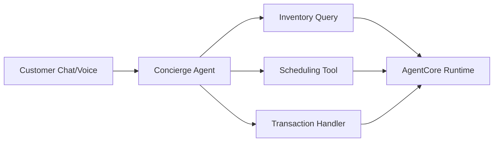

{/*
  HIDDEN PENDING VERIFICATION - do not restore to navigation until resolved.
  This page's content must be verified or removed. This story has no public
  source link and seven TODO-marked unverified claims. Do not restore until an
  externally shareable source exists; then rebuild the page from that source
  using the customer-story template.
*/}

# Kavak - Autonomous Concierge Agent

 **Workload:** Conversational agent

**Industry:** Automotive marketplace | **Workload pattern:** Conversational, end-to-end journey | **Integration type:** Inventory, scheduling, transaction systems

---

## Source

No public source currently available. Do not restore to navigation until an externally shareable source exists.

---

## Customer context

Kavak is Latin America's largest used car marketplace operating across multiple countries. The company handles high volumes of customer inquiries about vehicle availability, financing options, test drive scheduling, and transaction support.

---

## Challenge

{/* TODO: Update challenge details when public reference is available */}

High volume of customer inquiries overwhelmed human agents. Customers experienced long wait times, and agents spent significant time on repetitive questions rather than complex negotiations.

---

## Solution

{/* TODO: Update solution details when public reference is available */}

Kavak chose to build an autonomous concierge agent for the automotive marketplace, handling customer inquiries, scheduling, and transaction support through natural conversation. The agent manages the full customer journey from initial inquiry to purchase completion, with handoff to human agents when needed.

---

## AgentCore services used

| AgentCore Service | How Kavak configured it                                   | Why it mattered                                                   |
|-------------------|-----------------------------------------------------------|-------------------------------------------------------------------|
| Runtime           | Conversational agent, chat and voice interfaces           | Handles customer conversations in real time                      |
| Memory            | Session memory for conversation context                   | Remembered customer preferences and prior questions within the session |
| Identity          | Customer authentication for personalized experience       | Access to customer-specific inventory, pricing, and history      |

{/* TODO: Validate configuration details when public reference is available */}

---

## Architecture pattern

{/* TODO: Update when public reference is available */}

*Architecture interpretation by this site. No public source is currently available to verify this diagram.*

**Entry point:** Customer contact via chat or voice channel.
**Main flow:** The concierge agent routes the customer request to the appropriate tool (inventory lookup, scheduling, transaction handling). All tool calls execute on AgentCore Runtime.
**Key boundary:** Human handoff triggers when the conversation requires negotiation or complex problem-solving; the agent passes full conversation context to the human agent.

---

## Results

{/* TODO: Update with quantitative metrics when available */}

  Autonomous end-to-end customer journey
  Reduced wait times
  Natural conversation interface
  Smooth handoff to human agents

---

## Transferable lessons

{/* TODO: Validate lessons learned when public reference is available */}

- Kavak chose end-to-end journey coverage from inquiry to purchase rather than limiting the agent to FAQ-style responses. This reduced handoff friction and improved the customer experience.
- The team implemented multi-channel support (chat and voice) through a single agent, serving both web chat and phone interactions consistently.
- Context handoff quality to human agents was treated as a design requirement, not an afterthought. The agent passed full conversation context on escalation so customers did not need to repeat themselves.

---

## When this is relevant

This pattern fits high-volume customer service in transactional industries (automotive, real estate, insurance) where the customer journey spans multiple steps (inquiry, qualification, scheduling, transaction). The end-to-end coverage model is relevant when handoff friction between separate point-solution agents is a known customer pain point. Multi-channel consistency (chat and voice) applies where customers interact through multiple channels without expecting to restart their context.

---

## Source and verification

- No public source currently available.
- Last verified: 2026-07-15
