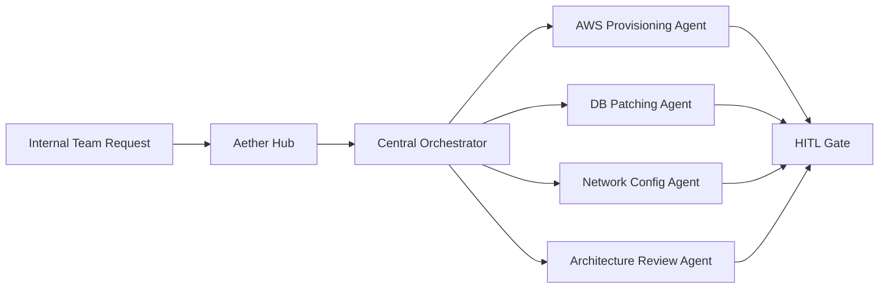

# Thomson Reuters - Agentic Platform Engineering Hub

 **Workload:** Agent platform

 [Blog Post →](https://aws.amazon.com/blogs/machine-learning/how-thomson-reuters-built-an-agentic-platform-engineering-hub-with-amazon-bedrock-agentcore/)

**Industry:** Legal / Media | **Workload pattern:** Orchestrator + specialists (HITL) | **Integration type:** Cloud APIs, databases, network systems

---

## Source

[AWS Machine Learning Blog - How Thomson Reuters Built an Agentic Platform Engineering Hub with Amazon Bedrock AgentCore](https://aws.amazon.com/blogs/machine-learning/how-thomson-reuters-built-an-agentic-platform-engineering-hub-with-amazon-bedrock-agentcore/)

Publication date: See linked source.

---

## Customer context

Thomson Reuters is a global content and technology company serving legal, tax, accounting, and compliance markets. Its internal platform engineering team handles cloud provisioning, database patching, network configuration, and architecture reviews for teams across the company.

---

## Challenge

Internal teams spent excessive time on routine platform engineering tasks. Each task required navigating multiple systems, understanding tool-specific syntax, and waiting for platform engineering team availability. The bottleneck was consistent regardless of task urgency.

---

## Solution

Thomson Reuters chose to build an internal platform engineering hub called "Aether" where teams request infrastructure changes through natural language. A central orchestrator agent (built with LangGraph) interprets the request and delegates to specialized service agents for cloud provisioning, DB patching, network configuration, and architecture reviews. Human-in-the-loop gates protect sensitive operations before execution.

---

## AgentCore services used

| AgentCore Service | How Thomson Reuters configured it                         | Why it mattered                                                   |
|-------------------|-----------------------------------------------------------|-------------------------------------------------------------------|
| Runtime           | LangGraph central orchestrator + specialized agents       | Each service domain had its own agent with domain-specific tools  |
| Memory            | Cross-session context on recurring infrastructure tasks   | Remembered patterns and preferences for repeated requests        |
| Gateway           | Unified tool access for cloud APIs, DBs, network systems  | Centralized governance and audit over privileged operations      |
| Identity          | End-user identity propagated through agent calls          | Every action traceable to a human requestor                      |

---

## Architecture pattern

*Architecture interpretation by this site based on the public source.*

The diagram above shows a natural language request entering the Aether hub, a LangGraph orchestrator classifying and routing it to the appropriate specialist agent, and a human-in-the-loop gate intercepting sensitive operations before they execute against production infrastructure.

**Entry point:** Natural language infrastructure request from an internal team.
**Main flow:** The central orchestrator classifies the request and delegates to one or more specialist agents, each with domain-scoped tools. Sensitive operations pass through a human-in-the-loop gate before execution.
**Key boundary:** The Gateway service centralizes all privileged API access; specialist agents do not hold credentials directly.

---

## Results

  Self-service infrastructure via natural language
  Human-in-the-loop for sensitive operations
  Standardized agent patterns across org
  Reduced platform engineering toil

---

## Transferable lessons

- Thomson Reuters chose a central orchestrator plus specialist agents over a single mega-agent. Each specialist became deep in its domain (cloud, DB, network), which improved accuracy and made it easier to extend individual agents without affecting others.
- The team treated human-in-the-loop gates as a feature rather than a limitation. Requiring human approval on sensitive operations increased organizational trust and accelerated adoption across teams that had previously been skeptical of automation.
- Using a natural language interface rather than CLI or form-based tooling removed adoption friction. Teams described what they needed without learning system-specific syntax.

---

## When this is relevant

This pattern fits platform and DevOps teams that manage a large surface area of privileged operations across multiple domains. The orchestrator-plus-specialists approach is most effective when domains (cloud, network, DB) have genuinely different toolsets and expertise requirements. Human-in-the-loop gates are appropriate when the cost of an incorrect automated action (e.g., a misconfigured firewall rule) is high enough to warrant a confirmation step.

---

## Source and verification

- [AWS Machine Learning Blog - How Thomson Reuters Built an Agentic Platform Engineering Hub with Amazon Bedrock AgentCore](https://aws.amazon.com/blogs/machine-learning/how-thomson-reuters-built-an-agentic-platform-engineering-hub-with-amazon-bedrock-agentcore/)
- Last verified: 2026-07-15
