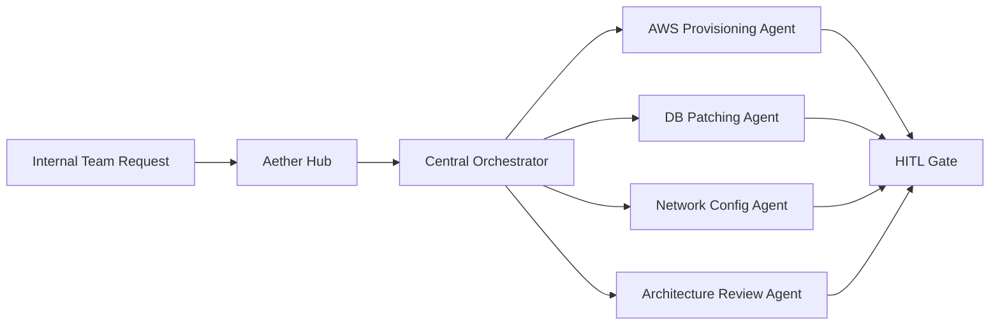

# Thomson Reuters - Agentic Platform Engineering Hub

 **Workload:** Agent platform

 [Blog Post →](https://aws.amazon.com/blogs/machine-learning/how-thomson-reuters-built-an-agentic-platform-engineering-hub-with-amazon-bedrock-agentcore/)

---

## Architecture

## Customer Story

**Customer:** Thomson Reuters, a global content and technology company serving legal, tax, accounting, and compliance markets

**Challenge:** Internal teams spent excessive time on routine platform engineering tasks including cloud provisioning, database patching, network configuration, and architecture reviews. Each task required navigating multiple systems, understanding tool-specific syntax, and waiting for platform engineering team availability.

**Solution:** Platform engineering hub called "Aether" where internal teams request infrastructure changes through natural language. A central orchestrator agent (built with LangGraph) interprets the request and delegates to specialized service agents for cloud provisioning, DB patching, network config, and architecture reviews. Human-in-the-loop gates protect sensitive operations before execution.

## AgentCore Configuration

| AgentCore Service | Configuration for Thomson Reuters                         | Why It Matters                                                    |
|-------------------|-----------------------------------------------------------|-------------------------------------------------------------------|
| Runtime           | LangGraph central orchestrator + specialized agents       | Each service domain has its own agent with domain tools          |
| Memory            | Cross-session context on recurring infrastructure tasks   | Remembers patterns and preferences for repeat requests           |
| Gateway           | Unified tool access for cloud APIs, DBs, network systems  | Centralized governance and audit over privileged operations      |
| Identity          | End-user identity propagated through agent calls          | Every action is traceable to a human requestor                   |

## Key Technical Decisions

- **Central orchestrator delegates to specialized agents** rather than one mega-agent. Each service agent (AWS provisioning, DB patching, etc.) has narrow scope and deep domain knowledge.
- **Human-in-the-loop gates on sensitive operations** because full automation of privileged actions like network changes was a non-starter for security. Agents prepare the change, humans approve.
- **Natural language interface** rather than form-based or CLI-based tooling. Internal teams described what they needed in plain English, and the orchestrator routed it.

## Results

  Self-service infrastructure via natural language
  Human-in-the-loop for sensitive operations
  Standardized agent patterns across org
  Reduced platform engineering toil

## Lessons Learned

- **Orchestrator plus specialists beats monolith** when operations span multiple domains (cloud, DB, network). Each agent became an expert in its area.
- **HITL is a feature, not a compromise.** Requiring human approval on sensitive changes increased organizational trust and adoption.
- **Natural language interface removed adoption friction.** No CLI syntax to learn, no forms to fill out. Just describe what you need.
