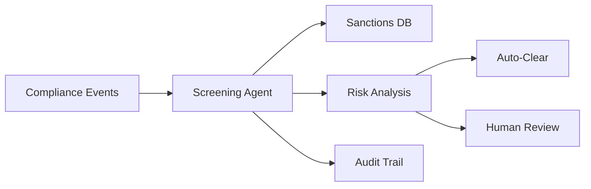

# Amazon Compliance - Sanctions Screening Automation

 **Workload:** Workflow agent

---

## Architecture

---

## Customer Story

**Customer:** Amazon Compliance Team

**Challenge:** High volume of transactions requiring sanctions screening with manual review creating bottlenecks and risking compliance gaps. Manual processes could not keep pace with transaction volume while maintaining required audit trails.

**Solution:** Automated sanctions screening with AI agents processing compliance events and flagging potential violations with full audit trails. Agents triage routine cases and escalate complex scenarios to human reviewers. The system maintains detailed logs of all decisions for regulatory compliance.

---

## AgentCore Configuration

| Service         | Configuration                                  | Purpose                                      |
|-----------------|------------------------------------------------|----------------------------------------------|
| Runtime         | Event-driven invocation, 5-minute timeout      | Process compliance events in real time       |
| Observability   | Structured logs with compliance event IDs      | Full audit trail for regulatory reporting    |
| Evaluations     | Human review feedback loop for accuracy        | Continuous model quality improvement         |

---

## AgentCore Services

Runtime Observability Evaluations

---

## Results

  Automated sanctions screening
  Full audit trail
  Reduced manual review burden
  Faster compliance processing

<!-- TODO: Update with actual metrics from customer -->
**Key Metrics:**
- Processing time per transaction: [X minutes → Y seconds]
- Auto-clear rate: [X%]
- False positive reduction: [X%]
- Annual transactions processed: [N million]

---

## Lessons Learned

**Audit first, optimize second:** In compliance workflows, the audit trail is not an afterthought. Structured logging with immutable event IDs must be part of the initial design.

**Human-in-the-loop refines the model:** Capturing feedback from escalated cases and feeding it back into evaluations creates a continuous improvement loop for agent accuracy.

**Conservative thresholds early:** Starting with aggressive escalation thresholds (when uncertain, escalate) builds trust with compliance teams. Thresholds can be relaxed as the agent proves accuracy.
