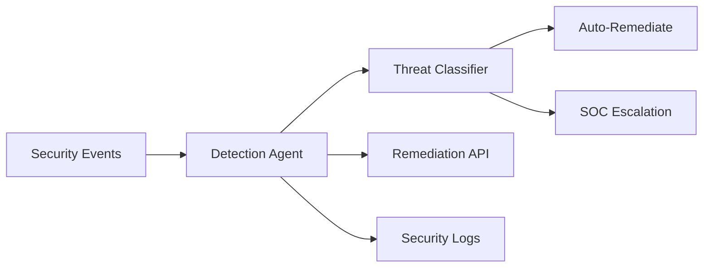

# Druva - Data Security Agents

 **Workload:** Workflow agent

---

## Architecture

---

## Customer Story

**Customer:** Druva - Cloud data protection and management company

**Challenge:** Growing volume and sophistication of data security threats requiring faster detection and response than manual processes can provide. Security team was overwhelmed by alert volume and unable to respond to genuine threats quickly enough.

**Solution:** Event-driven agents monitoring data security events, automatically responding to threats and providing intelligent remediation recommendations. Agents classify threat severity and orchestrate appropriate response workflows, handling routine threats autonomously and escalating critical issues with full context.

---

## AgentCore Configuration

| Service         | Configuration                                  | Purpose                                      |
|-----------------|------------------------------------------------|----------------------------------------------|
| Runtime         | Event-driven, parallel execution               | Process security events in real time         |
| Observability   | Traces linked to security incident IDs         | Incident investigation and forensics         |

---

## AgentCore Services

Runtime Observability

---

## Results

  Automated threat detection
  Intelligent remediation
  Faster incident response
  Reduced security team toil

<!-- TODO: Update with actual metrics from customer -->
**Key Metrics:**
- Mean time to detect (MTTD): [X minutes → Y seconds]
- Mean time to remediate (MTTR): [X hours → Y minutes]
- False positive reduction: [X%]
- Security analyst time saved: [X hours/week]

---

## Lessons Learned

**Classification before action:** Clear threat severity classification (low/medium/high/critical) with distinct workflows per tier prevents both under-response and alert fatigue.

**Context matters for escalation:** When escalating to human analysts, agents should include not just the alert but also the analysis and attempted remediation steps. This reduces investigation time.

**Test your remediation actions:** Automated remediation in security workflows can cause outages if misconfigured. Dry-run mode and gradual rollout are essential.
