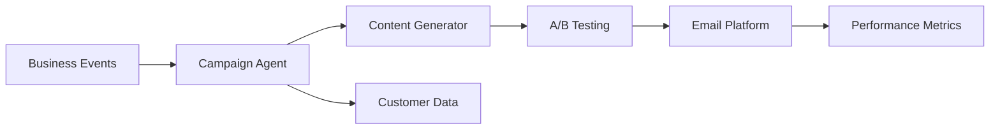

# EBG - Email Campaign Automation

 **Workload:** Workflow agent

---

## Architecture

---

## Customer Story

**Customer:** EBG - Digital marketing and e-commerce company

**Challenge:** Manual email campaign creation and optimization limiting throughput and personalization at scale. Marketing teams could not respond quickly to customer behavior signals or seasonal opportunities.

**Solution:** Event-driven agents automating email campaign creation, optimization, and delivery based on business triggers and customer behavior signals. Agents generate personalized content, optimize send times based on customer data, and iterate on campaign performance using A/B testing results.

---

## AgentCore Configuration

| Service         | Configuration                                  | Purpose                                      |
|-----------------|------------------------------------------------|----------------------------------------------|
| Runtime         | Event-driven, triggered by customer signals    | Real-time response to behavior events        |
| Observability   | Campaign ID linking across agent invocations   | Track end-to-end campaign performance        |

---

## AgentCore Services

Runtime Observability

---

## Results

  Automated campaign creation
  Event-driven personalization
  Increased campaign throughput
  Behavior-based optimization

<!-- TODO: Update with actual metrics from customer -->
**Key Metrics:**
- Campaign creation time: [X hours → Y minutes]
- Campaigns per month: [N campaigns]
- Personalization accuracy: [X%]
- Open rate improvement: [+Y%]

---

## Lessons Learned

**Start with simple triggers:** Event-driven marketing agents should start with clear, high-signal events (cart abandonment, milestone reached) before tackling nuanced behavioral patterns.

**A/B testing in the loop:** Feeding campaign performance metrics back to the agent creates a continuous optimization cycle. Track which content patterns drive engagement.

**Brand voice guardrails:** Generated marketing content needs clear guidelines and approval workflows. Policy engine rules can enforce tone, terminology, and compliance requirements.
