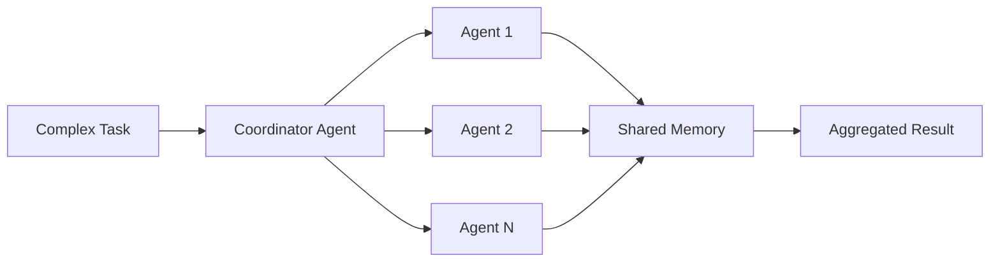

# LobeHub - Multi-Agent Collaboration

 **Workload:** Swarm

---

## Architecture

---

## Customer Story

**Customer:** LobeHub - Open-source AI agent platform

**Challenge:** Complex tasks requiring multiple specialized capabilities that exceed the scope of any single agent. Traditional orchestration patterns require explicit choreography that does not adapt to dynamic task requirements.

**Solution:** Multi-agent collaboration platform where agents autonomously collaborate on complex tasks through the swarm pattern. Agents negotiate task allocation, share intermediate results through shared memory, and converge on solutions without central orchestration. Each agent contributes its specialty while maintaining awareness of the collective goal.

---

## AgentCore Configuration

| Service         | Configuration                                  | Purpose                                      |
|-----------------|------------------------------------------------|----------------------------------------------|
| Runtime         | Parallel execution, long-lived sessions        | Multiple agents active simultaneously        |
| Memory          | Shared memory namespace for agent coordination | Inter-agent communication and state sharing  |
| Observability   | Trace spans per agent with parent task ID      | Debug swarm behavior and handoffs            |

---

## AgentCore Services

Runtime Memory Observability

---

## Results

  Autonomous multi-agent collaboration
  Complex task decomposition
  No central orchestration required
  Scalable to N agents

<!-- TODO: Update with actual metrics from customer -->
**Key Metrics:**
- Average agents per complex task: [N agents]
- Task completion rate: [X%]
- Time to solution vs single agent: [X% faster]
- Coordination overhead: [Y% of total time]

---

## Lessons Learned

**Shared memory prevents redundant work:** Without a mechanism to share intermediate results, agents will duplicate work. A namespace convention (task ID prefix) keeps memory organized.

**Observability is critical for swarms:** When multiple agents collaborate autonomously, tracing becomes essential to understand which agent contributed what and where coordination failed.

**Convergence criteria matter:** Swarms need clear success conditions. Without explicit "done" signals, agents can loop indefinitely or produce conflicting outputs.
