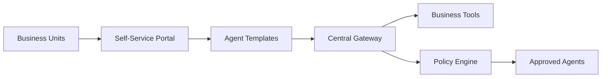

# Marubeni - GenAI Democratization

 **Workload:** Agent platform

---

## Architecture

---

## Customer Story

**Customer:** Marubeni Corporation - Major Japanese integrated trading and investment company

**Challenge:** Democratizing AI capabilities across a diverse conglomerate with varied technical maturity across business units. Business teams wanted to deploy AI agents but lacked the expertise to build them safely and compliantly.

**Solution:** Enterprise platform democratizing AI agent access across the organization, with standardized templates and governance. Non-technical teams can deploy agents using pre-built patterns while central platform team maintains quality and compliance. The platform abstracts infrastructure complexity and enforces security policies automatically.

---

## AgentCore Configuration

| Service         | Configuration                                  | Purpose                                      |
|-----------------|------------------------------------------------|----------------------------------------------|
| Runtime         | Template-based with approved base images       | Consistent agent deployment patterns         |
| Gateway         | Centralized tool catalog with approval flow    | Controlled access to business systems        |
| Identity        | Per-business-unit identity isolation           | Users only access their BU's agents          |

---

## AgentCore Services

Runtime Gateway Identity

---

## Results

  Democratized AI access
  Standardized governance
  Non-technical user enablement
  Enterprise-scale compliance

<!-- TODO: Update with actual metrics from customer -->
**Key Metrics:**
- Business units using platform: [N BUs]
- Agents deployed by non-technical teams: [X%]
- Time from request to deployment: [Y days]
- Policy compliance rate: [X%]

---

## Lessons Learned

**Self-service needs guardrails:** Democratization without governance creates risk. Template-based deployment with built-in policy enforcement lets non-technical users move fast safely.

**Tool approval process is non-negotiable:** Allowing business units to connect agents to any system creates security and data governance gaps. Centralized tool catalog with approval workflow is essential.

**Success metrics differ by maturity:** For less technical business units, adoption and time-to-deployment matter more than agent sophistication. Meet teams where they are.
