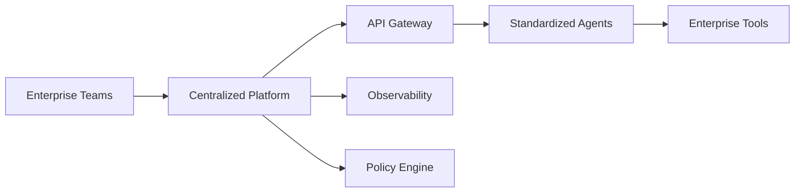

# Swisscom - Enterprise Agentic AI Platform

 **Workload:** Agent platform

---

## Architecture

---

## Customer Story

**Customer:** Swisscom - Switzerland's leading telecom provider

**Challenge:** Scaling agentic AI across a large enterprise while maintaining governance, security, and operational standards. Individual teams were building agents in silos without consistent patterns for authentication, monitoring, or policy enforcement.

**Solution:** Enterprise-scale agentic AI platform with standardized agent deployment, monitoring, and governance across the organization. Central platform team provides templates, guardrails, and observability for all agent deployments. Teams can quickly deploy agents using approved patterns while the platform handles identity, policy, and operational concerns.

---

## AgentCore Configuration

| Service         | Configuration                                  | Purpose                                      |
|-----------------|------------------------------------------------|----------------------------------------------|
| Runtime         | Multiple environments (dev/staging/prod)       | Isolated agent execution per environment     |
| Gateway         | Centralized tool registry, semantic search     | Unified tool catalog across all teams        |
| Identity        | OAuth2 with enterprise SSO integration         | Per-user auth for all agent interactions     |
| Observability   | Unified logging, traces to central SIEM        | Enterprise-wide agent monitoring             |
| Policy Engine   | Template policies for common patterns          | Consistent governance across agent types     |

---

## AgentCore Services

Runtime Gateway Observability Identity

---

## Results

  Enterprise-wide agent standardization
  Centralized governance
  Consistent monitoring across agents
  Reduced time-to-deploy

<!-- TODO: Update with actual metrics from customer -->
**Key Metrics:**
- Agent deployment time: [X days → Y hours]
- Teams using platform: [N teams]
- Policy compliance rate: [X%]
- Reduction in operational overhead: [X%]

---

## Lessons Learned

**Platform over point solutions:** Investing in a centralized platform upfront reduces duplication and governance gaps as agent adoption scales across business units.

**Templates accelerate adoption:** Pre-built agent templates with built-in observability and policy patterns let teams focus on business logic instead of infrastructure.

**Governance is not optional:** Enterprise-scale agent deployment requires policy enforcement from day one. Retrofitting governance after teams have deployed agents is significantly harder than building it into the platform.
