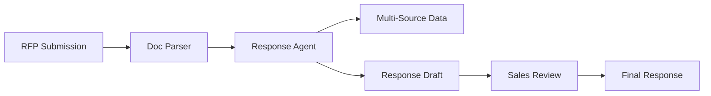

# WBD - Advertising RFP Response Automation

 **Workload:** Workflow agent

---

## Architecture

---

## Customer Story

**Customer:** Warner Bros. Discovery (WBD) - Global media and entertainment company

**Challenge:** Advertising RFP responses requiring manual data gathering across multiple systems, consuming significant sales team time. Sales teams spent hours compiling audience metrics, pricing data, and content schedules for each RFP instead of focusing on client relationships.

**Solution:** Agents automatically processing advertising RFP requests, gathering relevant data from multiple sources (audience systems, inventory databases, content calendars), and generating tailored responses for the media sales team. Reduces response time from days to hours while maintaining quality and accuracy.

---

## AgentCore Configuration

| Service         | Configuration                                  | Purpose                                      |
|-----------------|------------------------------------------------|----------------------------------------------|
| Runtime         | Document processing optimized, 10-min timeout  | Handle large RFP documents                   |
| Memory          | RFP context stored for follow-up questions     | Multi-stage response refinement              |

---

## AgentCore Services

Runtime Memory

---

## Results

  Automated RFP processing
  Multi-source data aggregation
  Faster response turnaround
  Sales team freed for strategic work

<!-- TODO: Update with actual metrics from customer -->
**Key Metrics:**
- RFP response time: [X days → Y hours]
- Data sources integrated: [N systems]
- Manual hours saved per RFP: [X hours]
- RFP volume handled: [N per month]

---

## Lessons Learned

**Document structure varies:** RFP documents lack standard formats. Agents need flexible parsing strategies and should flag ambiguous sections for human clarification rather than guessing.

**Memory enables refinement:** Sales teams often need to iterate on generated responses. Storing RFP context in memory allows follow-up prompts like "emphasize streaming audience reach" without re-uploading documents.

**Data freshness matters:** RFP responses include time-sensitive data (current inventory, pricing). Agents should fetch data at response time, not cache stale information.
