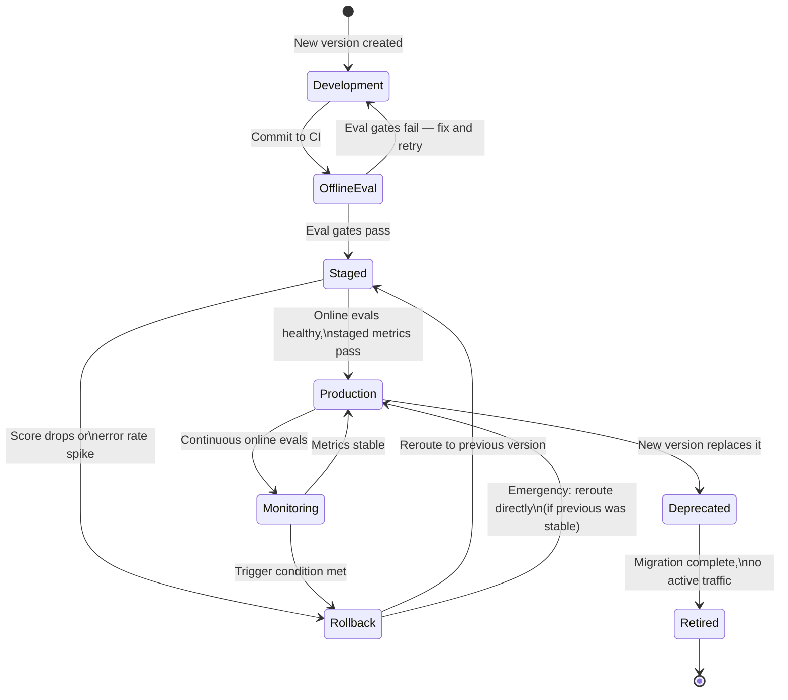

import Link from '@docusaurus/Link';

# Releases and Rollback

:::tip Who this is for
This page is for teams designing deployment pipelines and rollback strategies for production agents. If you are still iterating on your prototype, start with the [Production Readiness](./production-readiness) checklist and return here when you are ready to design your release process.
:::

Releasing a new agent version and rolling back a bad one are both routine operations. Both become faster and safer when you design for them before they are needed. This page covers how to version agent artifacts, how to roll out changes gradually — including AgentCore's native A/B testing capability — when and how to roll back, and how to deprecate and retire agents that are no longer needed.

For the full developer guide, see the [Amazon Bedrock AgentCore Developer Guide](https://docs.aws.amazon.com/bedrock-agentcore/latest/devguide/agent-runtime-versioning.html).

---

## Version Lifecycle Diagram

The following diagram shows the lifecycle of an agent version from initial development through retirement. Each state is described in detail in the sections below.



The diagram above describes seven states in an agent version's life. Development and OfflineEval happen before any real traffic. Staged is the controlled rollout phase with limited production traffic. Production is full rollout under continuous monitoring. Rollback reroutes traffic to a previous stable version. Deprecated marks a version as superseded. Retired means the version is decommissioned and its resources cleaned up.

---

## What Constitutes a Version

An agent's behavior is determined by a combination of artifacts. A meaningful "version" captures all of them together, not just one:

<div className="fancy-table">

| Artifact | Why it matters for versioning |
|---|---|
| System prompt | The primary behavioral specification; small prompt changes can cause large behavioral shifts |
| Tool definitions | The names, descriptions, and schemas that the model uses to decide when and how to call tools |
| Model identifier | Bedrock model IDs include the specific model version; switching to a new model snapshot is a version change |
| AgentCore Runtime config | Session duration, memory configuration, and runtime parameters |
| Cedar policies | The authorization rules that govern what the agent is allowed to do |
| Application code | Lambda functions, tool implementations, and any orchestration code |
| Evaluation thresholds | The pass/fail criteria used to gate this version's release |

</div>

A version is a named, immutable snapshot of all these artifacts together. If any artifact changes, that is a new version. See [AgentCore Runtime versioning](https://docs.aws.amazon.com/bedrock-agentcore/latest/devguide/agent-runtime-versioning.html) for how the platform manages runtime version snapshots.

### Storing Versions

Architecture guidance:
- Store system prompts and tool definitions in version control (git) alongside application code. Treat prompt changes with the same discipline as code changes: review, test, and release them through the same pipeline.
- Tag every deployment with a semantic version string (e.g., `v2.3.1`) or a build identifier. Log the version identifier on every agent invocation so that production traces can be correlated to specific versions.
- Retain at least the previous two released versions in a deployable state. When a rollback is needed, having to reconstruct a previous version from git history under pressure is slower and riskier than deploying a pre-built artifact.

---

## A/B Testing with AgentCore

AgentCore provides native A/B testing as a managed capability. You can split live production traffic between two agent variants — control and treatment — and let the platform's online evaluation measure both variants simultaneously, reporting statistical significance when enough data accumulates.

### Two Modes

**Config-bundle A/B testing** runs both variants on the same runtime endpoint but with different configuration bundles (e.g., different system prompts, model parameters, or tool configurations). This is the fastest way to test a behavioral change without redeploying infrastructure.

**Target-based A/B testing** routes traffic to entirely different endpoint targets — for example, two distinct AgentCore runtime deployments running different code versions.

For details on choosing between modes, see the [A/B testing overview](https://docs.aws.amazon.com/bedrock-agentcore/latest/devguide/ab-testing.html), [config-bundle mode](https://docs.aws.amazon.com/bedrock-agentcore/latest/devguide/ab-testing-config-bundle.html), and [target-based mode](https://docs.aws.amazon.com/bedrock-agentcore/latest/devguide/ab-testing-target-based.html).

### Traffic Splitting

AgentCore Gateway handles weighted traffic splitting. You set a weight (0–100) for each variant; the gateway routes incoming requests proportionally.

```bash
# Start an A/B test — the CLI requires a deployed gateway, variants,
# traffic weights, and online evaluation configuration(s).
# Use --disable-on-create to start the test in a stopped state,
# or --role-arn to specify an execution role.
agentcore run ab-test
```

You can also manage A/B tests programmatically. The equivalent API operations are `CreateABTest` and `GetABTest`, and you can poll results at any time with `agentcore view ab-test <id>` without affecting statistical validity. When results are significant, promote the winning variant with `agentcore promote ab-test -i <id>`. Both control and treatment variants are scored by online evaluators in parallel; the platform reports per-variant scores and statistical significance as traffic accumulates.

### Staged Rollout via A/B Testing

A typical progressive rollout using native A/B testing:

<div className="fancy-table">

| Stage | Treatment weight | Advancement criteria |
|---|---|---|
| Canary | 5–10% | Error rate and latency stable; no safety evaluation failures |
| Limited | 25–50% | Online evaluation scores match or exceed control; no cost spikes |
| Full | 100% | All metrics stable; previous version moved to deprecated |

</div>

Advance stages when the advancement criteria are met, not on a fixed time schedule. Advance faster when traffic volume is high enough for strong statistical confidence; advance more slowly when traffic is low.

### Infrastructure-Level Routing Alternatives

For traffic routing that lives entirely outside AgentCore (e.g., at the infrastructure layer before requests reach the AgentCore endpoint), the following patterns are common alternatives:

- **Lambda aliases with weighted routing**: if the agent's entry point is a Lambda function, Lambda's built-in weighted alias feature routes a configurable percentage of traffic to the new version.
- **Application Load Balancer weighted target groups**: route a percentage of requests to the new version's endpoint at the load balancer level.
- **Feature flag service**: a centralized feature flag routes specific tenants, users, or a percentage of traffic to the new version.
- **API Gateway canary deployments**: for agents exposed via API Gateway, canary deployments provide built-in percentage-based traffic splitting.

These approaches complement AgentCore's native A/B testing when you need routing decisions made before the AgentCore layer (e.g., tenant-based routing based on external state), or when you need to test infrastructure changes that span multiple services.

```python
# Example: Lambda alias with weighted routing (boto3)
import boto3

lambda_client = boto3.client("lambda")

# Route 10% of traffic to the new version ($LATEST or a specific version ARN),
# and 90% to the current stable version (already assigned to the alias)
lambda_client.update_alias(
    FunctionName="my-agent-handler",
    Name="production",
    RoutingConfig={
        "AdditionalVersionWeights": {
            "42": 0.10  # version number of the new candidate
        }
    }
)
```

---

## Rollback Triggers and Procedure

A rollback is a decision to stop routing traffic to the current version and resume routing to a previous known-good version.

### Trigger Conditions

Define rollback triggers before deploying to production. Triggers fall into three categories:

**Immediate rollback:**
- Safety evaluation score drops below the minimum acceptable threshold at any time.
- Harmful or policy-violating output confirmed in production.
- Error rate exceeds 3x the baseline rate sustained for more than 5 minutes.
- A Cedar policy bypass or unauthorized tool call confirmed.

**Hold and investigate (consider rollback):**
- Online evaluation correctness score drops more than 10% from the baseline established at release.
- Tool-call accuracy drops below the threshold that was required to pass offline evaluation.
- p99 latency exceeds 2x the SLA.
- Cost per invocation increases more than 2x over the previous version's baseline.

**Monitor (do not yet roll back):**
- A single metric dips briefly but recovers within minutes.
- A new type of user input that was not in the training dataset produces unexpected behavior once.

### Rollback Procedure

1. **Identify the last known-good version.** This should be the version that was deployed before the current one and passed all evaluation gates. It should be in a deployable state.
2. **Reroute traffic.** Update the routing configuration (AgentCore A/B test weights, Lambda alias, ALB target group, feature flag, or API Gateway canary) to send 100% of traffic to the known-good version. This is the single action that stops new requests from hitting the bad version.
3. **Verify the reroute.** Confirm that the known-good version is receiving traffic and that error rates and evaluation scores are recovering.
4. **Drain in-flight sessions.** For conversational agents with long sessions, decide whether to abruptly end active sessions on the bad version or let them complete. Abrupt termination is jarring to users but stops the bad behavior faster; graceful drain is smoother but prolongs exposure.
5. **Preserve evidence.** Before modifying anything further, preserve logs, traces, and evaluation data from the bad version. This is the evidence base for the post-incident review.
6. **Disable or quarantine the bad version.** Remove it from the rotation. Do not delete it; it may be needed for investigation.
7. **Open an incident.** Assign an owner, document the timeline, and begin root cause analysis.

### Post-Rollback

After a rollback, the bad version should not be re-released until:
- The root cause is identified and documented.
- A fix is implemented and verified in offline evaluation.
- The evaluation dataset is extended with a regression case that would have caught this failure.
- The release pipeline is re-run from the beginning for the fixed version.

---

## Deprecation and Retirement

Deprecating an agent version is the process of making it no longer the active version while keeping it available as a rollback target. Retiring it is the final cleanup step.

### Deprecation

Mark a version as deprecated when a newer version has been promoted to full production:

- Update the version's status in your deployment registry or configuration store.
- If the deprecated version was exposed via a named endpoint or alias, leave the alias in place but pointing to the new version.
- Document the deprecation: which version replaced it, when the replacement was fully deployed, and when the deprecated version will be retired.
- Notify any internal consumers that called the deprecated version directly (not through the canonical alias).

Deprecated versions should be retained in a deployable state for at least 30 days (or longer, depending on your rollback policy). Do not clean up the artifacts until you are confident the replacement version is stable.

### Retirement

Retiring a version means decommissioning its resources:

1. Confirm no traffic has been routed to this version for the retention period.
2. Archive logs, traces, and evaluation results to long-term storage (S3 Glacier or equivalent) if required for compliance.
3. Delete the Lambda function version or container image (but retain the artifact in the image registry for audit purposes if required).
4. Remove the CloudWatch log group or configure it to expire after the compliance retention window.
5. Check for and decommission any standing resources that were created for this version: DynamoDB tables, S3 buckets, Secrets Manager secrets.
6. Update the deployment registry to mark the version as retired.

When retiring an entire agent (not just a version), also decommission the AgentCore Runtime endpoint, memory namespaces associated with the agent, and any Gateway tool configurations that existed only for this agent.

---

## Further Reading

- [A/B Testing in AgentCore — Overview](https://docs.aws.amazon.com/bedrock-agentcore/latest/devguide/ab-testing.html)
- [Config-Bundle A/B Testing](https://docs.aws.amazon.com/bedrock-agentcore/latest/devguide/ab-testing-config-bundle.html)
- [Target-Based A/B Testing](https://docs.aws.amazon.com/bedrock-agentcore/latest/devguide/ab-testing-target-based.html)
- [AgentCore Runtime Versioning](https://docs.aws.amazon.com/bedrock-agentcore/latest/devguide/agent-runtime-versioning.html)
- [Runtime Lifecycle Settings](https://docs.aws.amazon.com/bedrock-agentcore/latest/devguide/runtime-lifecycle-settings.html)
- [AgentCost06-BP03: Design cost-efficient initialization through warm pools and caching](https://docs.aws.amazon.com/wellarchitected/latest/agentic-ai-lens/agentcost06-bp03.html)

:::warning Prototype boundary
This page walks through deployment actions that affect live agent traffic, including A/B test weight changes, alias updates, and resource decommissioning. Execute these steps in non-production environments first and confirm rollback paths before applying them to production.
:::

---

## Related Pages

<div className="tile-grid">
  <Link to="/docs/operate/production-readiness" className="tile-card">
    <div className="tile-heading"><h3>Production Readiness →</h3></div>
    <p>Rollback and deprecation checklist items and how they fit into the overall production-readiness program.</p>
  </Link>

  <Link to="/docs/operate/evaluations" className="tile-card">
    <div className="tile-heading"><h3>Evaluations →</h3></div>
    <p>How evaluation scores connect to rollback triggers and evaluation-gated releases.</p>
  </Link>

  <Link to="/docs/operate/cost-and-reliability" className="tile-card">
    <div className="tile-heading"><h3>Cost and Reliability →</h3></div>
    <p>Decommissioning resources during retirement to eliminate standing costs.</p>
  </Link>
</div>
