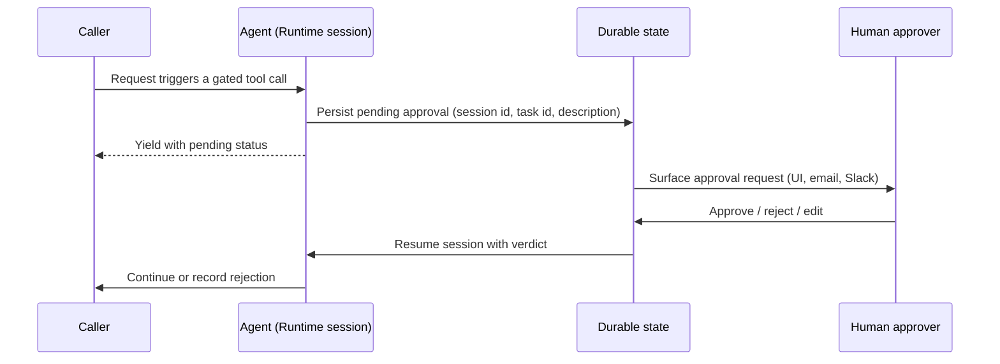

import Link from '@docusaurus/Link';

# Human-in-the-Loop Implementation

:::tip Who this is for
Builders who have decided an action needs human approval — via the [selection guide](/docs/patterns/selection-guide) or [bounded autonomy risk classification](/docs/workloads/workflow/bounded-autonomy) — and now need working code. For when to add HITL (and when not to), see the [pattern catalog](/docs/patterns/overview). For the failure modes this page helps you avoid, see [workflow challenge #8](/docs/workloads/workflow/challenges#8-human-in-the-loop-implementation-gaps).
:::

:::info Versions
Strands examples verified with **Strands Agents SDK** `1.52.0` and **bedrock-agentcore** `1.21.0`. LangGraph, Google ADK, and LlamaIndex snippets follow each framework's current published documentation (linked per section) — pin exact versions in your own project before copying.
:::

"Add a human approval step" is not a complete implementation. A working HITL gate answers four questions, and every framework answers them with different primitives:

1. **Identification** — how does the agent know *this* tool call needs approval?
2. **Tracking** — what identifies the pending approval (session ID, task ID) and what description does the approver see?
3. **Display** — how is the pending approval surfaced to a human (chat UI, email, Slack, dashboard)?
4. **Resumption** — how does the paused session continue after approve / reject / edit?

This page maps those four concerns to concrete mechanisms — two platform-level options, then framework-level code for Strands, LangGraph, Google ADK, and LlamaIndex. All of them deploy to [AgentCore Runtime](https://docs.aws.amazon.com/bedrock-agentcore/latest/devguide/runtime-how-it-works.html).

---

## The Approval Lifecycle

Regardless of framework, every blocking HITL implementation follows the same lifecycle:



The critical property: the pause must survive process restarts. AgentCore Runtime sessions run in microVMs that can be recycled between the interrupt and the human's response, so pending-approval state belongs in a durable store (a framework checkpointer backed by a database, [AgentCore Memory](https://docs.aws.amazon.com/bedrock-agentcore/latest/devguide/memory.html), a Step Functions execution, or a [Lambda durable execution](https://docs.aws.amazon.com/lambda/latest/dg/durable-basic-concepts.html)) — not in process memory.

---

## Choosing a Mechanism

<div className="fancy-table fancy-table--auto-first">

| Mechanism | Status | Best for |
|---|---|---|
| [Gateway MCP elicitation](https://docs.aws.amazon.com/bedrock-agentcore/latest/devguide/gateway-mcp-elicitation.html) | **AgentCore-native** | Real-time, synchronous confirmations during a tool call, enforced at the Gateway layer |
| [Step Functions callback tokens](https://docs.aws.amazon.com/step-functions/latest/dg/tutorial-human-approval.html) | **Adjacent AWS service** | Asynchronous approvals that must survive days and cannot be bypassed by the agent |
| [Lambda Durable Functions callbacks](https://docs.aws.amazon.com/lambda/latest/dg/durable-basic-concepts.html) | **Adjacent AWS service** | The same durable, bypass-proof guarantee as Step Functions, when you prefer orchestration expressed as code rather than a state machine |
| Framework interrupts (Strands, LangGraph, ADK, LlamaIndex) | **Framework capability** | Approvals rendered in your own application UI, with full control over the experience |

</div>

These layers are complementary, not alternatives. [Cedar policies](/docs/workloads/workflow/bounded-autonomy) decide *whether the caller may ever use a tool*; HITL decides *whether this specific invocation proceeds*. The [Well-Architected Agentic AI Lens (AGENTSEC04-BP02)](https://docs.aws.amazon.com/wellarchitected/latest/agentic-ai-lens/agentsec04-bp02.html) covers risk-tiering which actions deserve a gate — routing *every* action through review produces rubber-stamp approvals.

---

## Platform-Level: Gateway MCP Elicitation

**AgentCore-native.** [Elicitation](https://docs.aws.amazon.com/bedrock-agentcore/latest/devguide/gateway-mcp-elicitation.html) lets an MCP server target behind an AgentCore Gateway request additional input from the client *mid-tool-call* — Form mode (structured fields such as an approve/deny choice) or URL mode (redirect the user to complete an action). The Gateway passes the elicitation through to the calling agent, which surfaces it to the user and returns the response.

- **Identification** — the MCP server decides: any tool handler can raise an elicitation before executing its side effect.
- **Tracking** — the MCP session (`Mcp-Session-Id` header) correlates the elicitation with the in-flight tool call; the elicitation message carries the description.
- **Display** — the agent's `elicitation_callback` renders the form or opens the URL. The developer guide includes [Strands `MCPClient` examples](https://docs.aws.amazon.com/bedrock-agentcore/latest/devguide/gateway-mcp-elicitation.html) for both modes.
- **Resumption** — synchronous: the tool call completes once the response arrives. Requires `streamingConfiguration.enableResponseStreaming: true` on the gateway.

Use this when the approver is the same person driving the session and the answer arrives in seconds, not days.

---

## Platform-Level: Out-of-Band AWS Orchestration

**Adjacent AWS service.** For approvals that must be durable, auditable, and impossible for the agent to bypass, put the gate *outside* the agent in an AWS orchestrator that persists the pause independently of the agent's process. Two AWS options give this same guarantee, differing only in how you express the orchestration — a declarative state machine ([Step Functions](https://docs.aws.amazon.com/step-functions/latest/dg/tutorial-human-approval.html)) or orchestration-as-code ([Lambda Durable Functions](https://docs.aws.amazon.com/lambda/latest/dg/durable-basic-concepts.html)). The next two sections cover each; pick based on orchestration style, not capability.

### Step Functions callback tokens

Put the gate in a [Step Functions workflow with a task token](https://docs.aws.amazon.com/step-functions/latest/dg/tutorial-human-approval.html):

- **Identification** — the agent tool starts a Step Functions execution instead of performing the side effect directly.
- **Tracking** — the **task token** is the durable approval ID and the **execution ARN** is the task ID; the execution input carries the description (what, why, estimated impact).
- **Display** — the workflow notifies approvers via [Amazon SNS](https://docs.aws.amazon.com/step-functions/latest/dg/callback-task-sample-sqs.html) (email, SMS) or any system a Lambda can reach (Slack, a ticketing queue).
- **Resumption** — the approver's decision calls `SendTaskSuccess` or `SendTaskFailure` with the token; the workflow resumes even days later. The agent either polls a status tool or is re-invoked by the workflow.

Because the pause lives in Step Functions state rather than in the agent's reasoning, a prompt-injected agent cannot talk its way past the gate — the requirement called out in [workflow challenge #8](/docs/workloads/workflow/challenges#8-human-in-the-loop-implementation-gaps). The [AWS HITL patterns sample](https://github.com/aws-samples/sample-human-in-the-loop-patterns) implements this end to end (its "Method 3"), including a separate `check_status` tool so the session can query the pending approval later.

---

### Lambda Durable Functions callbacks

[Lambda Durable Functions](https://docs.aws.amazon.com/lambda/latest/dg/durable-basic-concepts.html) provide the same durable, out-of-band gate, but express the orchestration as ordinary code in a single Lambda rather than a state machine. A durable execution uses a [checkpoint-and-replay mechanism](https://docs.aws.amazon.com/lambda/latest/dg/durable-basic-concepts.html) to track progress, suspend, and resume — for up to a year — so the approval wait costs nothing while it is pending. The gate is the SDK's [callback operation](https://docs.aws.amazon.com/durable-functions/sdk-reference/operations/callback/):

- **Identification** — the agent tool (or a step in the durable function) calls `context.waitForCallback` instead of performing the side effect directly.
- **Tracking** — the callback creates a durable **callback ID** that identifies the pending approval; the durable execution's checkpointed state carries the description (what, why, estimated impact).
- **Display** — the code that starts the callback dispatches the request to approvers via [Amazon SNS](https://docs.aws.amazon.com/step-functions/latest/dg/callback-task-sample-sqs.html), Slack, or a ticketing queue — the same notification surfaces as the Step Functions path.
- **Resumption** — the approver's decision calls [`SendDurableExecutionCallbackSuccess`](https://docs.aws.amazon.com/durable-functions/sdk-reference/operations/callback/) with the callback ID; the durable execution replays completed checkpoints and resumes from the wait, even days later. Durable functions must be invoked through a qualified identifier (version or alias).

Like the Step Functions gate, the pause lives outside the model's reasoning, so a prompt-injected agent cannot bypass it. The [async AgentCore + durable functions sample](https://github.com/aws-samples/sample-bedrock-agentcore-async-stepfunctions) (its "Strategy C") shows the whole pipeline — including the `waitForCallback` pause on an AgentCore agent — expressed as one durable function, alongside two Step Functions strategies for direct comparison.

> **Guidance:** Step Functions callback tokens and Durable Functions callbacks are interchangeable for the durability and bypass-resistance an approval gate needs; the choice is orchestration style (state machine vs. code), not capability. This reflects the two AWS-sample implementations linked above and is not an official AWS recommendation of one over the other.

---

## Strands Agents

The [AWS blog on human-in-the-loop constructs](https://aws.amazon.com/blogs/machine-learning/human-in-the-loop-constructs-for-agentic-workflows-in-healthcare-and-life-sciences/) and its companion repo [`aws-samples/sample-human-in-the-loop-patterns`](https://github.com/aws-samples/sample-human-in-the-loop-patterns) demonstrate four runnable methods on AgentCore Runtime. The core primitive is the **hook system**: a `HookProvider` intercepts `BeforeToolCallEvent` and raises an interrupt before a gated tool executes.

```python
from strands.hooks import HookProvider, HookRegistry, BeforeToolCallEvent

class ApprovalHook(HookProvider):
    SENSITIVE_TOOLS = ["update_stock_count", "issue_refund"]

    def register_hooks(self, registry: HookRegistry, **kwargs) -> None:
        registry.add_callback(BeforeToolCallEvent, self.approve)

    def approve(self, event: BeforeToolCallEvent) -> None:
        tool_name = event.tool_use["name"]
        if tool_name not in self.SENSITIVE_TOOLS:
            return

        # "Trust for this session" was granted earlier
        approval_key = f"{tool_name}-approval"
        if event.agent.state.get(approval_key) == "t":
            return

        # Pause the agent loop; the reason payload is the approval description
        approval = event.interrupt(
            approval_key,
            reason={"reason": f"Authorize {tool_name} with args: {event.tool_use.get('input', {})}"},
        )
        if approval.lower() not in ["y", "yes", "t"]:
            event.cancel_tool = f"User denied permission to run {tool_name}"
            return
        if approval.lower() == "t":
            event.agent.state.set(approval_key, "t")
```

How this answers the four concerns:

- **Identification** — the `SENSITIVE_TOOLS` list (or any predicate over `event.tool_use`) selects gated calls without modifying the tools themselves. For per-tool logic instead, embed `tool_context.interrupt()` inside the tool body (the sample's "Method 2"), which can read session context such as the caller's role.
- **Tracking** — the `approval_key` names the interrupt; the `reason` payload is the human-readable description. The AgentCore Runtime session ID scopes the whole exchange, and `agent.state` persists per-session decisions like "trust this tool".
- **Display** — in interrupt/resume mode the agent stops with `stop_reason == "interrupt"`; your application returns the interrupt content to the frontend (an approval dialog) or forwards it to Slack/email.
- **Resumption** — re-invoke the agent in the same session with the human's response; the hook receives it as the `interrupt()` return value. Denial sets `event.cancel_tool`, which the model sees as the tool result.

> **Guidance:** Prefer the hook/interrupt mechanism over hand-rolled "ask the model to wait for approval" prompting. A gate implemented in the system prompt is advisory; a gate implemented in the agent loop is deterministic.

---

## LangGraph

LangGraph models HITL as **graph suspension**: compile with a checkpointer, interrupt before the execution node, and resume the thread later. See the [LangGraph `interrupt` announcement](https://www.langchain.com/blog/making-it-easier-to-build-human-in-the-loop-agents-with-interrupt) and [Building production-ready agents with LangGraph and AgentCore](https://dev.to/aws/building-production-ready-ai-agents-with-langgraph-and-amazon-bedrock-agentcore-4h5k).

```python
from langgraph.types import Command, interrupt

def human_approval(state: dict) -> Command:
    # Suspends the graph; payload is persisted to the checkpointer
    verdict = interrupt({
        "question": "Approve this refund?",
        "draft": state["draft"],          # full context for the approver
    })
    return Command(goto="execute" if verdict == "approve" else "abort")
```

```python
# The thread_id is the durable task/session key
config = {"configurable": {"thread_id": "ticket-A-9133"}}
graph.invoke({"user_message": "Refund order A-9133"}, config)   # runs until interrupt

# Inspect the pending action to display to the approver
snapshot = graph.get_state(config)
pending = snapshot.values["draft"]

# Approver decides — resume the same thread
graph.invoke(Command(resume="approve"), config)                  # approve
graph.update_state(config, {"draft": edited_draft})              # or edit, then resume
```

- **Identification** — `interrupt()` inside a node, or `interrupt_before=["node_name"]` at compile time to gate a whole node.
- **Tracking** — the **`thread_id`** is the session/task key; the interrupt payload and the drafted action live in checkpointed state, retrievable with `get_state()` for display.
- **Display** — your application reads the interrupted thread's state and renders it (see the AG-UI section below for a managed frontend path).
- **Resumption** — `invoke(Command(resume=...), config)` continues from the checkpoint. Model all four verdicts explicitly: approve (resume as drafted), edit (`update_state` then resume), reject (route to an abort branch), and request-more-info (loop back to the agent).

> **Guidance:** On AgentCore Runtime, use a database-backed checkpointer (Postgres, DynamoDB) keyed by the runtime session ID rather than `MemorySaver` — the microVM hosting the session can be recycled while the approval is pending. This deployment pattern reflects community experience and is not an official AWS recommendation.

---

## Google ADK

ADK's primitive is the [**`LongRunningFunctionTool`**](https://google.github.io/adk-docs/tools/function-tools/): the gated tool starts the operation and returns a `pending` status, the run ends, and the *client application* owns the wait-and-resume. Google's official [`hitl` sample](https://github.com/google/adk-python/tree/main/contributing/samples/hitl) demonstrates the full loop.

```python
from google.adk.tools import LongRunningFunctionTool

def ask_for_approval(purpose: str, amount: float) -> dict:
    """Create an approval ticket and return a pending status."""
    ticket_id = create_ticket(purpose, amount)   # your ticketing/queue system
    return {"status": "pending", "ticket_id": ticket_id}

approval_tool = LongRunningFunctionTool(func=ask_for_approval)
```

```python
# Later, when the human approves, resume the SAME session and invocation
runner.run_async(
    user_id="u_123",
    session_id="s_abc",
    invocation_id="invocation-123",   # from the original run's event history
    new_message=updated_function_response,  # {"status": "approved", "ticket_id": ...}
)
```

- **Identification** — wrap any approval-requiring function in `LongRunningFunctionTool`; the returned `pending` payload ends the run instead of blocking it.
- **Tracking** — the triple **`user_id` + `session_id` + `invocation_id`** identifies the paused work; your `ticket_id` links it to the external approval record. ADK's docs recommend carrying the `invocation_id` in the long-running request so the response can target the correct invocation.
- **Display** — entirely client-owned: the pending event carries the function call details, which your application forwards to any approval surface.
- **Resumption** — send the final `FunctionResponse` back into the same session; with ADK's resumability configuration the workflow continues from its saved event history. Use a database-backed session service so sessions survive restarts.

---

## LlamaIndex

LlamaIndex workflows pause with a **waiter event** pair: the tool emits `InputRequiredEvent` and waits for a matching `HumanResponseEvent`. See the [official HITL guide](https://docs.llamaindex.ai/en/latest/understanding/agent/human_in_the_loop/) and the full-stack [`human_in_the_loop_workflow_demo`](https://github.com/run-llama/human_in_the_loop_workflow_demo) (FastAPI websocket backend + React approve/reject buttons).

```python
from llama_index.core.workflow import (
    Context, InputRequiredEvent, HumanResponseEvent,
)

async def dangerous_task(ctx: Context) -> str:
    """A task that requires human confirmation before executing."""
    question = "Are you sure you want to proceed?"
    response = await ctx.wait_for_event(
        HumanResponseEvent,
        waiter_id=question,                       # the approval key
        waiter_event=InputRequiredEvent(prefix=question),
    )
    if response.response.strip().lower() == "yes":
        return "Task completed."
    return "Task aborted."
```

```python
handler = workflow.run(user_msg="Proceed with the dangerous task.")
async for event in handler.stream_events():
    if isinstance(event, InputRequiredEvent):
        answer = await show_approval_ui(event.prefix)   # your display layer
        handler.ctx.send_event(HumanResponseEvent(response=answer))
result = await handler
```

- **Identification** — the gated tool itself calls `ctx.wait_for_event(...)`; subclass the built-in events when the approval needs structured fields.
- **Tracking** — `waiter_id` is the approval key and `prefix` is the description; the workflow handler's context is the session scope.
- **Display** — the caller streams events and renders `InputRequiredEvent` however it likes; the demo repo shows websocket delivery to a browser UI.
- **Resumption** — inject `HumanResponseEvent` back into the same handler. For pauses that must survive a process restart, use the workflow state snapshot/resume support in [LlamaIndex TypeScript workflows](https://developers.llamaindex.ai/typescript/workflows/common_patterns/human_in_the_loop/) or persist your own snapshot keyed by the runtime session ID.

---

## Displaying Approvals: AG-UI and CopilotKit

If the approver is your application's end user, the [AG-UI protocol](https://aws.amazon.com/blogs/machine-learning/build-generative-ui-for-ai-agents-on-amazon-bedrock-agentcore-with-the-ag-ui-protocol/) standardizes the display-and-resume plumbing. AgentCore Runtime supports AG-UI as a native protocol, and CopilotKit renders the pending approval as a React component:

```tsx
useHumanInTheLoop({
  name: "scheduleTime",
  description: "Schedule a meeting with the user.",
  parameters: z.object({
    reasonForScheduling: z.string(),
    meetingDuration: z.number(),
  }),
  render: ({ respond, status, args }) => (
    <MeetingTimePicker status={status} respond={respond} {...args} />
  ),
});
```

The agent's tool call pauses, the component renders with the call's arguments as the approval context, and `respond()` resumes the agent with the human's answer. This works with both Strands and LangGraph backends behind the same frontend — see the [Strands AG-UI integration guide](https://strandsagents.com/docs/community/integrations/ag-ui/).

For approvers who are *not* in the session (an on-call engineer, a manager), fall back to the Step Functions + SNS pattern above, or post the pending approval into Slack or a ticketing system and resume via callback.

---

## Implementation Checklist

Distilled from [workflow challenge #8](/docs/workloads/workflow/challenges#8-human-in-the-loop-implementation-gaps) — verify each before shipping a gate:

<div className="fancy-table fancy-table--auto-first">

| Check | Why |
|---|---|
| Approval state is durable | The session must survive microVM recycling and multi-day waits |
| Request carries what / why / impact | Approvers without context rubber-stamp |
| Every request has a timeout | Decide per action whether timeout means deny or escalate |
| Every decision is logged | Audit trail, plus future evaluation data |
| Gate is enforced outside the model's reasoning | Prompt injection cannot bypass platform-level state |
| All four verdicts are modeled | Approve, edit, reject, request-more-info |
| Gates are risk-tiered, not universal | HITL on every action defeats automation ([AGENTSEC04-BP02](https://docs.aws.amazon.com/wellarchitected/latest/agentic-ai-lens/agentsec04-bp02.html)) |

</div>

---

## Further Reading

- [Human-in-the-loop constructs for agentic workflows (AWS ML Blog)](https://aws.amazon.com/blogs/machine-learning/human-in-the-loop-constructs-for-agentic-workflows-in-healthcare-and-life-sciences/) — four methods on Strands + AgentCore Runtime
- [aws-samples/sample-human-in-the-loop-patterns](https://github.com/aws-samples/sample-human-in-the-loop-patterns) — runnable code for all four methods
- [Gateway MCP elicitation](https://docs.aws.amazon.com/bedrock-agentcore/latest/devguide/gateway-mcp-elicitation.html) — AgentCore-native synchronous HITL
- [Step Functions human approval tutorial](https://docs.aws.amazon.com/step-functions/latest/dg/tutorial-human-approval.html) — durable callback tokens
- [Lambda Durable Functions basic concepts](https://docs.aws.amazon.com/lambda/latest/dg/durable-basic-concepts.html) — checkpoint-and-replay durable execution and callbacks
- [aws-samples/sample-bedrock-agentcore-async-stepfunctions](https://github.com/aws-samples/sample-bedrock-agentcore-async-stepfunctions) — async AgentCore invocation compared across Step Functions and a durable function (Strategy C)
- [Well-Architected Agentic AI Lens — AGENTSEC04-BP02](https://docs.aws.amazon.com/wellarchitected/latest/agentic-ai-lens/agentsec04-bp02.html) — risk-tiered human oversight
- [LangGraph interrupt](https://www.langchain.com/blog/making-it-easier-to-build-human-in-the-loop-agents-with-interrupt) — suspend/resume with checkpointers
- [Google ADK function tools](https://google.github.io/adk-docs/tools/function-tools/) — `LongRunningFunctionTool`
- [LlamaIndex human in the loop](https://docs.llamaindex.ai/en/latest/understanding/agent/human_in_the_loop/) — waiter events
- [Generative UI with AG-UI on AgentCore (AWS ML Blog)](https://aws.amazon.com/blogs/machine-learning/build-generative-ui-for-ai-agents-on-amazon-bedrock-agentcore-with-the-ag-ui-protocol/) — frontend approval components

---

## Related Pages

- <Link to="/docs/workloads/workflow/bounded-autonomy">Bounded Autonomy: Policy Engine →</Link>
- <Link to="/docs/workloads/workflow/challenges">Workflow Agent Challenges →</Link>
- <Link to="/docs/patterns/selection-guide">Pattern Selection Guide →</Link>
